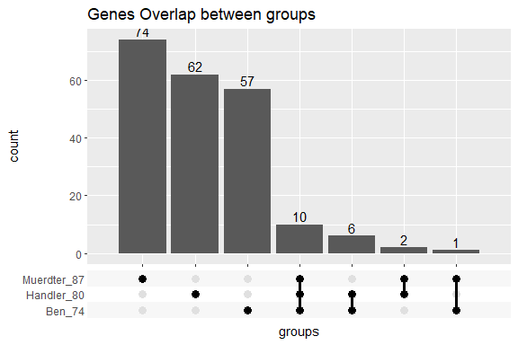
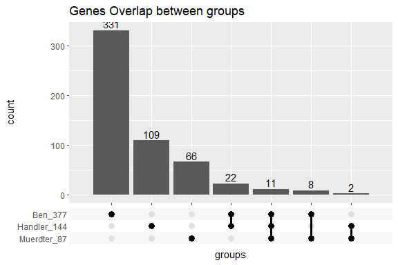
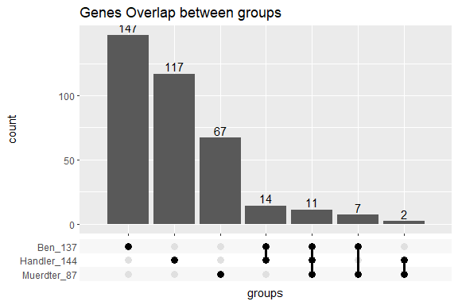

## I. Summary


+ 1. Highlight genes in all three screens

The following **11** genes were identified as piRNA pathway genes in all three screens.


```
##  [1] "armi"  "arx"   "Gasz"  "mael"  "Nxt1"  "Panx"  "RnpS1" "shu"   "vret" 
## [10] "wde"   "zuc"
```


+ 2. genes identified in at least **two** screens

The following **32** genes were identified in **two** screens. (the last one "NA" is gene "vas", the CG number was updated from "CG43081" to "CG46283" )


```
##  [1] "Acn"       "Aos1"      "Arp6"      "Caf1-105"  "CG4936"    "CG7379"   
##  [7] "CG7504"    "Cpsf5"     "crm"       "eIF4G2"    "FLASH"     "fs(1)Yb"  
## [13] "gw"        "His2Av"    "Karybeta3" "mago"      "MBD-R2"    "MEP-1"    
## [19] "mRpL13"    "mRpL35"    "Nup154"    "Nup54"     "nxf2"      "pcm"      
## [25] "piwi"      "Spt6"      "Tsp96F"    "tsu"       "Uba2"      "Wdr82"    
## [31] "YL-1"      NA
```


## II. Results

### 1. Group1: 74-49-87

Candidate genes:  
  
  - 74 genes, Czech Benjamin (Greg lab)    
  
  - 49 genes, Handler Dominik (Julius lab)    
  
  - 87 genes, Muerdter Felix (Greg lab)  

The positive genes reported in each screen.


<!-- -->

Overlapped genes:

+ Overlap in all screens: 


 num  FBID                                                    CG        Symbol                                          
----  ------------------------------------------------------  --------  ------------------------------------------------
   1  [FBgn0041164](http://flybase.org/reports/FBgn0041164)   CG11513   [armi](http://flybase.org/reports/FBgn0041164)  
   2  [FBgn0036826](http://flybase.org/reports/FBgn0036826)   CG3893    [arx](http://flybase.org/reports/FBgn0036826)   
   3  [FBgn0033273](http://flybase.org/reports/FBgn0033273)   CG2183    [Gasz](http://flybase.org/reports/FBgn0033273)  
   4  [FBgn0016034](http://flybase.org/reports/FBgn0016034)   CG11254   [mael](http://flybase.org/reports/FBgn0016034)  
   5  [FBgn0034617](http://flybase.org/reports/FBgn0034617)   CG9754    [Panx](http://flybase.org/reports/FBgn0034617)  
   6  [FBgn0037707](http://flybase.org/reports/FBgn0037707)   CG16788   [RnpS1](http://flybase.org/reports/FBgn0037707) 
   7  [FBgn0003401](http://flybase.org/reports/FBgn0003401)   CG4735    [shu](http://flybase.org/reports/FBgn0003401)   
   8  [FBgn0263143](http://flybase.org/reports/FBgn0263143)   CG4771    [vret](http://flybase.org/reports/FBgn0263143)  
   9  [FBgn0027499](http://flybase.org/reports/FBgn0027499)   CG12340   [wde](http://flybase.org/reports/FBgn0027499)   
  10  [FBgn0261266](http://flybase.org/reports/FBgn0261266)   CG12314   [zuc](http://flybase.org/reports/FBgn0261266)   

+ Overlap in at least two screens


 num  FBID                                                    CG        Symbol                                             
----  ------------------------------------------------------  --------  ---------------------------------------------------
   1  [FBgn0263198](http://flybase.org/reports/FBgn0263198)   CG10473   [Acn](http://flybase.org/reports/FBgn0263198)      
   2  [FBgn0033526](http://flybase.org/reports/FBgn0033526)   CG12892   [Caf1-105](http://flybase.org/reports/FBgn0033526) 
   3  [FBgn0035842](http://flybase.org/reports/FBgn0035842)   CG7504    [CG7504](http://flybase.org/reports/FBgn0035842)   
   4  [FBgn0000928](http://flybase.org/reports/FBgn0000928)   CG2706    [fs(1)Yb](http://flybase.org/reports/FBgn0000928)  
   5  [FBgn0001197](http://flybase.org/reports/FBgn0001197)   CG5499    [His2Av](http://flybase.org/reports/FBgn0001197)   
   6  [FBgn0035357](http://flybase.org/reports/FBgn0035357)   CG1244    [MEP-1](http://flybase.org/reports/FBgn0035357)    
   7  [FBgn0036640](http://flybase.org/reports/FBgn0036640)   CG4118    [nxf2](http://flybase.org/reports/FBgn0036640)     
   8  [FBgn0028411](http://flybase.org/reports/FBgn0028411)   CG12752   [Nxt1](http://flybase.org/reports/FBgn0028411)     
   9  [FBgn0004872](http://flybase.org/reports/FBgn0004872)   CG6122    [piwi](http://flybase.org/reports/FBgn0004872)     


### 2. Group2: 377-144-87

Candidate genes:  
  
  - 377 genes, Czech Benjamin (Greg lab)    
  
  - 144 genes, Handler Dominik (Julius lab)    
  
  - 87 genes, Muerdter Felix (Greg lab)  

For Benjamin screen, instead use average Z-score of four TEs <= -2.0 (74 genes), at least Z-score <= -2.0 for **one** TE. (377 genes).  

For Dominik screen, change the criteria of staining from 2.0 (49 genes) to 1.0 (144 genes).


<!-- -->

+ Overlaped in all three screens


 num  FBID                                                    CG        Symbol                                          
----  ------------------------------------------------------  --------  ------------------------------------------------
   1  [FBgn0041164](http://flybase.org/reports/FBgn0041164)   CG11513   [armi](http://flybase.org/reports/FBgn0041164)  
   2  [FBgn0036826](http://flybase.org/reports/FBgn0036826)   CG3893    [arx](http://flybase.org/reports/FBgn0036826)   
   3  [FBgn0033273](http://flybase.org/reports/FBgn0033273)   CG2183    [Gasz](http://flybase.org/reports/FBgn0033273)  
   4  [FBgn0016034](http://flybase.org/reports/FBgn0016034)   CG11254   [mael](http://flybase.org/reports/FBgn0016034)  
   5  [FBgn0028411](http://flybase.org/reports/FBgn0028411)   CG12752   [Nxt1](http://flybase.org/reports/FBgn0028411)  
   6  [FBgn0034617](http://flybase.org/reports/FBgn0034617)   CG9754    [Panx](http://flybase.org/reports/FBgn0034617)  
   7  [FBgn0037707](http://flybase.org/reports/FBgn0037707)   CG16788   [RnpS1](http://flybase.org/reports/FBgn0037707) 
   8  [FBgn0003401](http://flybase.org/reports/FBgn0003401)   CG4735    [shu](http://flybase.org/reports/FBgn0003401)   
   9  [FBgn0263143](http://flybase.org/reports/FBgn0263143)   CG4771    [vret](http://flybase.org/reports/FBgn0263143)  
  10  [FBgn0027499](http://flybase.org/reports/FBgn0027499)   CG12340   [wde](http://flybase.org/reports/FBgn0027499)   
  11  [FBgn0261266](http://flybase.org/reports/FBgn0261266)   CG12314   [zuc](http://flybase.org/reports/FBgn0261266)   


+ Overlaped, in at least **two** screens


 num  FBID                                                    CG        Symbol                                              
----  ------------------------------------------------------  --------  ----------------------------------------------------
   1  [FBgn0263198](http://flybase.org/reports/FBgn0263198)   CG10473   [Acn](http://flybase.org/reports/FBgn0263198)       
   2  [FBgn0029512](http://flybase.org/reports/FBgn0029512)   CG12276   [Aos1](http://flybase.org/reports/FBgn0029512)      
   3  [FBgn0011741](http://flybase.org/reports/FBgn0011741)   CG11678   [Arp6](http://flybase.org/reports/FBgn0011741)      
   4  [FBgn0033526](http://flybase.org/reports/FBgn0033526)   CG12892   [Caf1-105](http://flybase.org/reports/FBgn0033526)  
   5  [FBgn0038768](http://flybase.org/reports/FBgn0038768)   CG4936    [CG4936](http://flybase.org/reports/FBgn0038768)    
   6  [FBgn0038546](http://flybase.org/reports/FBgn0038546)   CG7379    [CG7379](http://flybase.org/reports/FBgn0038546)    
   7  [FBgn0035842](http://flybase.org/reports/FBgn0035842)   CG7504    [CG7504](http://flybase.org/reports/FBgn0035842)    
   8  [FBgn0035987](http://flybase.org/reports/FBgn0035987)   CG3689    [Cpsf5](http://flybase.org/reports/FBgn0035987)     
   9  [FBgn0000376](http://flybase.org/reports/FBgn0000376)   CG2714    [crm](http://flybase.org/reports/FBgn0000376)       
  10  [FBgn0260634](http://flybase.org/reports/FBgn0260634)   CG10192   [eIF4G2](http://flybase.org/reports/FBgn0260634)    
  11  [FBgn0033806](http://flybase.org/reports/FBgn0033806)   CG4616    [FLASH](http://flybase.org/reports/FBgn0033806)     
  12  [FBgn0000928](http://flybase.org/reports/FBgn0000928)   CG2706    [fs(1)Yb](http://flybase.org/reports/FBgn0000928)   
  13  [FBgn0051992](http://flybase.org/reports/FBgn0051992)   CG31992   [gw](http://flybase.org/reports/FBgn0051992)        
  14  [FBgn0001197](http://flybase.org/reports/FBgn0001197)   CG5499    [His2Av](http://flybase.org/reports/FBgn0001197)    
  15  [FBgn0087013](http://flybase.org/reports/FBgn0087013)   CG1059    [Karybeta3](http://flybase.org/reports/FBgn0087013) 
  16  [FBgn0002736](http://flybase.org/reports/FBgn0002736)   CG9401    [mago](http://flybase.org/reports/FBgn0002736)      
  17  [FBgn0038016](http://flybase.org/reports/FBgn0038016)   CG10042   [MBD-R2](http://flybase.org/reports/FBgn0038016)    
  18  [FBgn0035357](http://flybase.org/reports/FBgn0035357)   CG1244    [MEP-1](http://flybase.org/reports/FBgn0035357)     
  19  [FBgn0032720](http://flybase.org/reports/FBgn0032720)   CG10603   [mRpL13](http://flybase.org/reports/FBgn0032720)    
  20  [FBgn0038923](http://flybase.org/reports/FBgn0038923)   CG13410   [mRpL35](http://flybase.org/reports/FBgn0038923)    
  21  [FBgn0021761](http://flybase.org/reports/FBgn0021761)   CG4579    [Nup154](http://flybase.org/reports/FBgn0021761)    
  22  [FBgn0033737](http://flybase.org/reports/FBgn0033737)   CG8831    [Nup54](http://flybase.org/reports/FBgn0033737)     
  23  [FBgn0036640](http://flybase.org/reports/FBgn0036640)   CG4118    [nxf2](http://flybase.org/reports/FBgn0036640)      
  24  [FBgn0020261](http://flybase.org/reports/FBgn0020261)   CG3291    [pcm](http://flybase.org/reports/FBgn0020261)       
  25  [FBgn0004872](http://flybase.org/reports/FBgn0004872)   CG6122    [piwi](http://flybase.org/reports/FBgn0004872)      
  26  [FBgn0028982](http://flybase.org/reports/FBgn0028982)   CG12225   [Spt6](http://flybase.org/reports/FBgn0028982)      
  27  [FBgn0027865](http://flybase.org/reports/FBgn0027865)   CG6120    [Tsp96F](http://flybase.org/reports/FBgn0027865)    
  28  [FBgn0033378](http://flybase.org/reports/FBgn0033378)   CG8781    [tsu](http://flybase.org/reports/FBgn0033378)       
  29  [FBgn0029113](http://flybase.org/reports/FBgn0029113)   CG7528    [Uba2](http://flybase.org/reports/FBgn0029113)      
  30  [FBgn0032030](http://flybase.org/reports/FBgn0032030)   CG17293   [Wdr82](http://flybase.org/reports/FBgn0032030)     
  31  [FBgn0032321](http://flybase.org/reports/FBgn0032321)   CG4621    [YL-1](http://flybase.org/reports/FBgn0032321)      
  32  [n.d.](http://flybase.org/reports/n.d.)                 NA        [NA](http://flybase.org/reports/n.d.)               


### 3. Group2: 137-144-87

Candidate genes:  
  
  - 137 genes, Czech Benjamin (Greg lab)    
  
  - 144 genes, Handler Dominik (Julius lab)    
  
  - 87 genes, Muerdter Felix (Greg lab)  

For Benjamin screen, instead use average Z-score of four TEs <= -2.0 (74 genes), at least Z-score <= -2.0 for **two** TEs. (137 genes).  

For Dominik screen, change the criteria of staining from 2.0 (49 genes) to 1.0 (144 genes).


<!-- -->


+ Overlaped in all three screens


 num  FBID                                                    CG        Symbol                                          
----  ------------------------------------------------------  --------  ------------------------------------------------
   1  [FBgn0041164](http://flybase.org/reports/FBgn0041164)   CG11513   [armi](http://flybase.org/reports/FBgn0041164)  
   2  [FBgn0036826](http://flybase.org/reports/FBgn0036826)   CG3893    [arx](http://flybase.org/reports/FBgn0036826)   
   3  [FBgn0033273](http://flybase.org/reports/FBgn0033273)   CG2183    [Gasz](http://flybase.org/reports/FBgn0033273)  
   4  [FBgn0016034](http://flybase.org/reports/FBgn0016034)   CG11254   [mael](http://flybase.org/reports/FBgn0016034)  
   5  [FBgn0028411](http://flybase.org/reports/FBgn0028411)   CG12752   [Nxt1](http://flybase.org/reports/FBgn0028411)  
   6  [FBgn0034617](http://flybase.org/reports/FBgn0034617)   CG9754    [Panx](http://flybase.org/reports/FBgn0034617)  
   7  [FBgn0037707](http://flybase.org/reports/FBgn0037707)   CG16788   [RnpS1](http://flybase.org/reports/FBgn0037707) 
   8  [FBgn0003401](http://flybase.org/reports/FBgn0003401)   CG4735    [shu](http://flybase.org/reports/FBgn0003401)   
   9  [FBgn0263143](http://flybase.org/reports/FBgn0263143)   CG4771    [vret](http://flybase.org/reports/FBgn0263143)  
  10  [FBgn0027499](http://flybase.org/reports/FBgn0027499)   CG12340   [wde](http://flybase.org/reports/FBgn0027499)   
  11  [FBgn0261266](http://flybase.org/reports/FBgn0261266)   CG12314   [zuc](http://flybase.org/reports/FBgn0261266)   


+ Overlaped, in at least two screens


 num  FBID                                                    CG        Symbol                                              
----  ------------------------------------------------------  --------  ----------------------------------------------------
   1  [FBgn0263198](http://flybase.org/reports/FBgn0263198)   CG10473   [Acn](http://flybase.org/reports/FBgn0263198)       
   2  [FBgn0029512](http://flybase.org/reports/FBgn0029512)   CG12276   [Aos1](http://flybase.org/reports/FBgn0029512)      
   3  [FBgn0011741](http://flybase.org/reports/FBgn0011741)   CG11678   [Arp6](http://flybase.org/reports/FBgn0011741)      
   4  [FBgn0033526](http://flybase.org/reports/FBgn0033526)   CG12892   [Caf1-105](http://flybase.org/reports/FBgn0033526)  
   5  [FBgn0038546](http://flybase.org/reports/FBgn0038546)   CG7379    [CG7379](http://flybase.org/reports/FBgn0038546)    
   6  [FBgn0035842](http://flybase.org/reports/FBgn0035842)   CG7504    [CG7504](http://flybase.org/reports/FBgn0035842)    
   7  [FBgn0260634](http://flybase.org/reports/FBgn0260634)   CG10192   [eIF4G2](http://flybase.org/reports/FBgn0260634)    
   8  [FBgn0033806](http://flybase.org/reports/FBgn0033806)   CG4616    [FLASH](http://flybase.org/reports/FBgn0033806)     
   9  [FBgn0000928](http://flybase.org/reports/FBgn0000928)   CG2706    [fs(1)Yb](http://flybase.org/reports/FBgn0000928)   
  10  [FBgn0001197](http://flybase.org/reports/FBgn0001197)   CG5499    [His2Av](http://flybase.org/reports/FBgn0001197)    
  11  [FBgn0087013](http://flybase.org/reports/FBgn0087013)   CG1059    [Karybeta3](http://flybase.org/reports/FBgn0087013) 
  12  [FBgn0002736](http://flybase.org/reports/FBgn0002736)   CG9401    [mago](http://flybase.org/reports/FBgn0002736)      
  13  [FBgn0038016](http://flybase.org/reports/FBgn0038016)   CG10042   [MBD-R2](http://flybase.org/reports/FBgn0038016)    
  14  [FBgn0035357](http://flybase.org/reports/FBgn0035357)   CG1244    [MEP-1](http://flybase.org/reports/FBgn0035357)     
  15  [FBgn0033737](http://flybase.org/reports/FBgn0033737)   CG8831    [Nup54](http://flybase.org/reports/FBgn0033737)     
  16  [FBgn0036640](http://flybase.org/reports/FBgn0036640)   CG4118    [nxf2](http://flybase.org/reports/FBgn0036640)      
  17  [FBgn0004872](http://flybase.org/reports/FBgn0004872)   CG6122    [piwi](http://flybase.org/reports/FBgn0004872)      
  18  [FBgn0028982](http://flybase.org/reports/FBgn0028982)   CG12225   [Spt6](http://flybase.org/reports/FBgn0028982)      
  19  [FBgn0027865](http://flybase.org/reports/FBgn0027865)   CG6120    [Tsp96F](http://flybase.org/reports/FBgn0027865)    
  20  [FBgn0033378](http://flybase.org/reports/FBgn0033378)   CG8781    [tsu](http://flybase.org/reports/FBgn0033378)       
  21  [FBgn0029113](http://flybase.org/reports/FBgn0029113)   CG7528    [Uba2](http://flybase.org/reports/FBgn0029113)      
  22  [FBgn0032030](http://flybase.org/reports/FBgn0032030)   CG17293   [Wdr82](http://flybase.org/reports/FBgn0032030)     
  23  [n.d.](http://flybase.org/reports/n.d.)                 NA        [NA](http://flybase.org/reports/n.d.)               


## III. Materials


### 1. Czech paper (Greg lab)


**Where**

  - Ovary, Germline specific genes

**How**

  - TE derepression upon knockdown of given genes.

**What** 
  
  - knock down genes by dsRNA;   
  - Check the expression of TEs (HetA, TAHRE, blood, burdock); (derepression); (LINE:HeT-A, TAHRE; LTR: blood, burdock), armi=positive, white=negative;
  - Filter by Z-score;  

**Results**
  
  - A total of 8171 genes were screened. [table S1](https://ars.els-cdn.com/content/image/1-s2.0-S1097276513002888-mmc2.xlsx).
  - 74 genes (Average Z-score <= -2.0) ;   
  - 216 genes (Average Z-score <= -1.5) ;   
  - 137 genes (Z-score <= -2.0, at least in two TEs) ;    
  - 377 genes (Z-score <= -2.0, at least in one TE) ;    

See [table S1](https://ars.els-cdn.com/content/image/1-s2.0-S1097276513002888-mmc2.xlsx) for details.


### 2. Handler paper (Julius lab)


**Where**

  - Ovary; somatic piRNA pathway

**What**
  
  - reporter: gypsy-LTR + beta-gal (controled by flam derived piRNAs)    
  - X-gal staining

**How**
  
  - The expression of flam was controled by piRNA pathway. (repression, no staining, white)    
  - The repression of flam was disrupted by specific gene knockdown (staining, blue)

**Results**
  
  - 49 genes, (staining >=2) ;      
  - 80 genes, (staining >= 1.5) ;   
  - 144 genes, (staining >= 1) ;
  
**Notes**

  - 7257 genes expressed in OSC (RPKM >= 1).    
  - VDRC 6818 genes, (2 crosses per gene).


See [tabld S1](https://ars.els-cdn.com/content/image/1-s2.0-S1097276513003365-mmc2.xlsx) for details.


### 3. Muerdter paper (Greg lab)


**Where**

  - OSS celline


**What**   
  
  - Check gypsy, ZAM, gypsy3 expression by qPCR ;    
  - TE derepression upon knockdown (KD) of any given genes


**How**  
  
  - genes were knockdown by dsRNA


**Results**
  
  - 87 genes, validated     
  - 52 genes, development defect      
  - 149 genes, non validated    

**Notes**

  - H3K9me3 decreased, piRNA levels not changed.

see [table S3](https://ars.els-cdn.com/content/image/1-s2.0-S1097276513002876-mmc3.xlsx) for details.


## Iv. Code


### 1. Czech (Greg lab)


```r
## Benjamin Czech, 2013 (Greg lab)
## table S1: https://ars.els-cdn.com/content/image/1-s2.0-S1097276513002888-mmc2.xlsx
## 
## Table S1. Raw Data for Primary Screen, Related to Figure 2. Shown are transformant IDs (of VDRC stock center; TID), library (Lib), viability of fly stock, and chromosome insertion (Chr) of the dsRNA for all 8,171 RNAi lines used. Gene IDs and synonyms are shown along with raw Z scores for HeTA, TAHRE, blood, and burdock.
##
## derepression threshold, Z-score
## genes; Z-score
## 74    -2.0
## 216   -1.5
## 137   -2.0 in at least two TE
## 377   -2.0 in at least one TE
fileURL <- "https://ars.els-cdn.com/content/image/1-s2.0-S1097276513002888-mmc2.xlsx"
fileTableS1  <- "data/1.Ben_2013_Greg_lab/TableS1.xlsx"
# download.file(fileURL, fileTableS1, method = "curl")

## including NA values (n.d.)
## 8171 records
df <- readxl::read_xlsx(fileTableS1, na = "n.d.") %>%
  dplyr::mutate(HeTA = as.numeric(HeTA),
                TAHRE = as.numeric(TAHRE),
                blood = as.numeric(blood),
                burdock = as.numeric(burdock))

## 8133 records
df$mean <- df[, 5:8] %>%
  rowMeans(na.rm = TRUE)
df <- dplyr::arrange(df, mean)

## df <- df[complete.cases(df), ]
df[is.na(df)] <- 0 

## threshold: -2.0 for each condition
df$status <- purrr::map(df[, 5:8], function(x) x <= -2.0) %>% 
  as.data.frame() %>%
  rowSums()

## threshold: -2.0, -1.5
sum(df$mean <= -2.0) # 74
```

```
## [1] 74
```

```r
sum(df$mean <= -1.5) # 216
```

```
## [1] 216
```

```r
sum(df$status >= 2)  # 137, at least in two TE
```

```
## [1] 137
```

```r
sum(df$status >= 1)  # 377, at least in two TE
```

```
## [1] 377
```

```r
## total
df1 <- df %>%
  dplyr::filter(status >= 1) %>%
  dplyr::mutate(FBID = mapIds(org.Dm.eg.db, keys = Gene, keytype = "FLYBASECG", column = "FLYBASE"),
                Symbol = mapIds(org.Dm.eg.db, keys = Gene, keytype = "FLYBASECG", column = "SYMBOL"),
                CG = Gene) %>%
  dplyr::select(FBID, CG, Symbol, mean, status)
```

```
## 'select()' returned 1:1 mapping between keys and columns
## 'select()' returned 1:1 mapping between keys and columns
```

```r
## save to table
file1 <- "data/1.Ben_2013_Greg_lab/01_screen_Ben_377.txt"
readr::write_delim(df1, file1, delim = "\t", na = "n.d.", col_names = TRUE) 

## 74 genes
df2 <- df1 %>%
  dplyr::filter(mean <= -2.0)

file2 <- "data/1.Ben_2013_Greg_lab/01_screen_Ben_74.txt"
readr::write_delim(df2, file2, delim = "\t", na = "n.d.", col_names = TRUE) 


## 137 genes
df3 <- df1 %>%
  dplyr::filter(mean <= -1.5)

file3 <- "data/1.Ben_2013_Greg_lab/01_screen_Ben_137.txt"
readr::write_delim(df3, file3, delim = "\t", na = "n.d.", col_names = TRUE) 
```


### 2. Handler (Julius lab)


```r
## Handler, 2013 (Julis lab)
## table S1: https://ars.els-cdn.com/content/image/1-s2.0-S1097276513003365-mmc2.xlsx
##
## Table S1. Primary and Verified Results of the Screen.
##
## genes (staining)
## 49 (>=2)
## 80 (>=1.5)
## 144 (>=1)
fileURL <- "https://ars.els-cdn.com/content/image/1-s2.0-S1097276513003365-mmc2.xlsx"
fileTableS1 <- "data/2.Handler_2013_Julius_lab/TableS1.xlsx"
# download.file(fileURL, fileTableS1, method = "curl")

## including blanks
df <- readxl::read_xlsx(fileTableS1, trim_ws = TRUE, skip = 1) %>% 
  dplyr::select(c(1, 2, 4, 6, 7, 9:14)) 
```

```
## New names:
## * `` -> ...3
## * `` -> ...5
## * staining -> staining...6
## * morphology -> morphology...7
## * `` -> ...8
## * ... and 8 more problems
```

```r
names(df) <- c("Symbol", "CG", "RPKM", "staining", "morphology",
               "VDRC_1", "staining_1", "morphology_1", 
               "VDRC_2", "staining_2", "morphology_2")
## staining
df_staining <- data.frame(
  value = c(0, 1, 1.5, 2, 2.5, 3),
  status = c("no staining", "weak staining",
             "intermediate-weak staining", "intermediate staining",
             "strong-intermediate staining", "strong staining"),
  stringsAsFactors = FALSE
)

df <- df %>% 
  dplyr::mutate(status = plyr::mapvalues(staining, 
                                         from = df_staining$value,
                                         to = df_staining$status))
# df <- df[complete.cases(df), ]
df[is.na(df)] <- 0

sum(df$staining >= 2)   # 49
```

```
## [1] 49
```

```r
sum(df$staining >= 1.5) # 80
```

```
## [1] 80
```

```r
sum(df$staining >= 1)   # 144
```

```
## [1] 144
```

```r
## pick 144 genes
df <- df %>%
  dplyr::filter(staining >= 1)

df1 <- df %>%
  dplyr::mutate(
    FBID = mapIds(org.Dm.eg.db, keys = CG, keytype = "FLYBASECG", column = "FLYBASE"),
    Symbol = mapIds(org.Dm.eg.db, keys = CG, keytype = "FLYBASECG", column = "SYMBOL")) %>%
  dplyr::select(FBID, CG, Symbol, staining, status)
```

```
## 'select()' returned 1:1 mapping between keys and columns
```

```
## 'select()' returned 1:1 mapping between keys and columns
```

```r
## save to table
file1 <- "data/2.Handler_2013_Julius_lab/02_screen_Handler_144.txt"
readr::write_delim(df1, file1, delim = "\t", na = "n.d.", col_names = TRUE)

## 80 genes
df2 <- df1 %>%
  dplyr::filter(staining >= 1.5)
##
file2 <- "data/2.Handler_2013_Julius_lab/02_screen_Handler_80.txt"
readr::write_delim(df2, file2, delim = "\t", na = "n.d.", col_names = TRUE)
```


### 3. Muerdter (Greg lab)


```r
## Muerdter, 2013 (Greg lab)
## table S1: https://ars.els-cdn.com/content/image/1-s2.0-S1097276513002876-mmc2.xlsx
## table S3: https://ars.els-cdn.com/content/image/1-s2.0-S1097276513002876-mmc3.xlsx
## Table S1. Primary Screen Results, Related to Figure 1.
## Table S3. Validation Screen Results, Related to Figure 2.
##
## genes (validated)
## 86 (va)
## 
fileURL <- "https://ars.els-cdn.com/content/image/1-s2.0-S1097276513002876-mmc3.xlsx"
fileTableS3 <- "data/3.Muertder_2013_Greg_lab/TableS3.xlsx"
# download.file(fileURL, fileTableS3, method = "curl")

## parsing data
df <- readxl::read_xlsx(fileTableS3, trim_ws = TRUE)
colnames(df) <- c("FBID", "TRANSID", "Symbol", "Fertility",
                  "fc_gypsy", "fc_gypsy3", "fc_ZAM", "status")

## 87 validated genes
length(
  df %>% 
    dplyr::filter(status %in% c("va")) %>%
    dplyr::pull("FBID") %>%
    unique())
```

```
## [1] 87
```

```r
## 52 dev defect
length(
  df %>% 
    dplyr::filter(status %in% c("dd")) %>%
    dplyr::pull("FBID") %>%
    unique())
```

```
## [1] 52
```

```r
## only va genes
df1 <- df %>% 
  dplyr::filter(status %in% c("va")) %>%
  dplyr::mutate(
    CG = mapIds(org.Dm.eg.db, keys = FBID, keytype = "FLYBASE", column = "FLYBASECG")
  ) %>%
  dplyr::select(FBID, CG, Symbol, status)
```

```
## 'select()' returned 1:1 mapping between keys and columns
```

```r
## save to table
file <- "data/3.Muertder_2013_Greg_lab/03_screen_Muerdter_87.txt"
readr::write_delim(df1, file, delim = "\t", na = "n.d.", col_names = TRUE)
```


## V. Reference

1.	Czech, B., Preall, J. B., McGinn, J. & Hannon, G. J. A Transcriptome-wide RNAi Screen in the Drosophila Ovary Reveals Factors of the Germline piRNA Pathway. Mol. Cell 50, 749–761 (2013). DOI: [10.1016/j.molcel.2013.04.007](https://doi.org/10.1016/j.molcel.2013.04.007)

2.	Handler, D. et al. The Genetic Makeup of the Drosophila piRNA Pathway. Mol. Cell 50, 762–777 (2013). DOI: [10.1016/j.molcel.2013.04.031](https://doi.org/10.1016/j.molcel.2013.04.031)    
3.	Muerdter, F. et al. A Genome-wide RNAi Screen Draws a Genetic Framework for Transposon Control and Primary piRNA Biogenesis in Drosophila. Mol. Cell 50, 736–748 (2013). DOI: [10.1016/j.molcel.2013.04.006](https://doi.org/10.1016/j.molcel.2013.04.006)    


