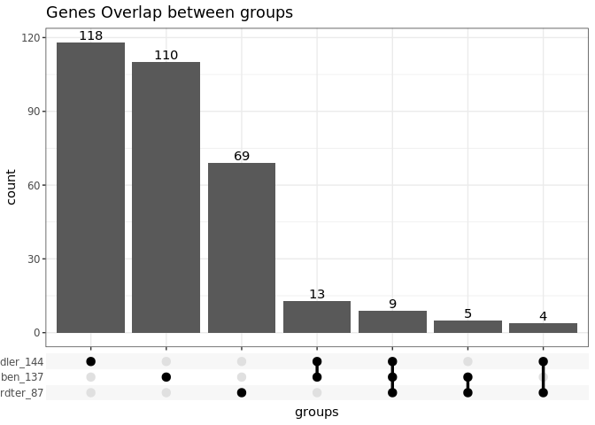

```
## 
## Attaching package: 'dplyr'
```

```
## The following objects are masked from 'package:stats':
## 
##     filter, lag
```

```
## The following objects are masked from 'package:base':
## 
##     intersect, setdiff, setequal, union
```

## README

Here are the hits of RNAi screen in fruitfly, by Greg and Julius lab in 2013, published on Mol Cell.

+ Ben (Greg lab)

  - 1. mean value <= -2.0 (n=74)
  
  - 2. mean value <= -1.5 (n=216)
  
  - 3. at least in two TEs, <= -2.0 (n=137)
  
  - 4. at least in one TE,  <= -2.0 (n=377)  

+ Handler (Julius lab) 

  - 1. staining >= 2.0 (n=49)
  
  - 2. staining >= 1.5 (n=80)
  
  - 3. staining >= 1.0 (n=144)

+ Muerdter (Greg lab) 

  - 1. va, validated genes (n=87)
  
  - 2. dd, development defect, (n=52)
  
  - 3. nv, non validated, (n=149)
  
## 1. gene list (137 + 144 + 87)


```
## 
##   1   2   3 
## 297  22   9
```

A total of **328** genes. **9** genes identified in all three screen; **22** genes were identified in two screen; **297** were identified in only one screen.

# <a href="" ></a>


```{=html}
<div class="datatables html-widget html-fill-item" id="htmlwidget-e256b8251ee7abfd5069" style="width:100%;height:auto;"></div>
<script type="application/json" data-for="htmlwidget-e256b8251ee7abfd5069">{"x":{"filter":"none","vertical":false,"extensions":["Buttons"],"data":[["<a href=http://flybase.org/reports/FBgn0000008 target='_blank'>FBgn0000008<\/a>","<a href=http://flybase.org/reports/FBgn0000032 target='_blank'>FBgn0000032<\/a>","<a href=http://flybase.org/reports/FBgn0000092 target='_blank'>FBgn0000092<\/a>","<a href=http://flybase.org/reports/FBgn0000139 target='_blank'>FBgn0000139<\/a>","<a href=http://flybase.org/reports/FBgn0000146 target='_blank'>FBgn0000146<\/a>","<a href=http://flybase.org/reports/FBgn0000163 target='_blank'>FBgn0000163<\/a>","<a href=http://flybase.org/reports/FBgn0000376 target='_blank'>FBgn0000376<\/a>","<a href=http://flybase.org/reports/FBgn0000451 target='_blank'>FBgn0000451<\/a>","<a href=http://flybase.org/reports/FBgn0000541 target='_blank'>FBgn0000541<\/a>","<a href=http://flybase.org/reports/FBgn0000928 target='_blank'>FBgn0000928<\/a>","<a href=http://flybase.org/reports/FBgn0001179 target='_blank'>FBgn0001179<\/a>","<a href=http://flybase.org/reports/FBgn0001197 target='_blank'>FBgn0001197<\/a>","<a href=http://flybase.org/reports/FBgn0001220 target='_blank'>FBgn0001220<\/a>","<a href=http://flybase.org/reports/FBgn0001222 target='_blank'>FBgn0001222<\/a>","<a href=http://flybase.org/reports/FBgn0001341 target='_blank'>FBgn0001341<\/a>","<a href=http://flybase.org/reports/FBgn0001624 target='_blank'>FBgn0001624<\/a>","<a href=http://flybase.org/reports/FBgn0001989 target='_blank'>FBgn0001989<\/a>","<a href=http://flybase.org/reports/FBgn0001994 target='_blank'>FBgn0001994<\/a>","<a href=http://flybase.org/reports/FBgn0002021 target='_blank'>FBgn0002021<\/a>","<a href=http://flybase.org/reports/FBgn0002736 target='_blank'>FBgn0002736<\/a>","<a href=http://flybase.org/reports/FBgn0002791 target='_blank'>FBgn0002791<\/a>","<a href=http://flybase.org/reports/FBgn0002962 target='_blank'>FBgn0002962<\/a>","<a href=http://flybase.org/reports/FBgn0003023 target='_blank'>FBgn0003023<\/a>","<a href=http://flybase.org/reports/FBgn0003162 target='_blank'>FBgn0003162<\/a>","<a href=http://flybase.org/reports/FBgn0003300 target='_blank'>FBgn0003300<\/a>","<a href=http://flybase.org/reports/FBgn0003321 target='_blank'>FBgn0003321<\/a>","<a href=http://flybase.org/reports/FBgn0003388 target='_blank'>FBgn0003388<\/a>","<a href=http://flybase.org/reports/FBgn0003401 target='_blank'>FBgn0003401<\/a>","<a href=http://flybase.org/reports/FBgn0003483 target='_blank'>FBgn0003483<\/a>","<a href=http://flybase.org/reports/FBgn0003607 target='_blank'>FBgn0003607<\/a>","<a href=http://flybase.org/reports/FBgn0003612 target='_blank'>FBgn0003612<\/a>","<a href=http://flybase.org/reports/FBgn0004227 target='_blank'>FBgn0004227<\/a>","<a href=http://flybase.org/reports/FBgn0004362 target='_blank'>FBgn0004362<\/a>","<a href=http://flybase.org/reports/FBgn0004400 target='_blank'>FBgn0004400<\/a>","<a href=http://flybase.org/reports/FBgn0004465 target='_blank'>FBgn0004465<\/a>","<a href=http://flybase.org/reports/FBgn0004644 target='_blank'>FBgn0004644<\/a>","<a href=http://flybase.org/reports/FBgn0004687 target='_blank'>FBgn0004687<\/a>","<a href=http://flybase.org/reports/FBgn0004828 target='_blank'>FBgn0004828<\/a>","<a href=http://flybase.org/reports/FBgn0004838 target='_blank'>FBgn0004838<\/a>","<a href=http://flybase.org/reports/FBgn0004872 target='_blank'>FBgn0004872<\/a>","<a href=http://flybase.org/reports/FBgn0004924 target='_blank'>FBgn0004924<\/a>","<a href=http://flybase.org/reports/FBgn0005648 target='_blank'>FBgn0005648<\/a>","<a href=http://flybase.org/reports/FBgn0005672 target='_blank'>FBgn0005672<\/a>","<a href=http://flybase.org/reports/FBgn0005683 target='_blank'>FBgn0005683<\/a>","<a href=http://flybase.org/reports/FBgn0010328 target='_blank'>FBgn0010328<\/a>","<a href=http://flybase.org/reports/FBgn0010387 target='_blank'>FBgn0010387<\/a>","<a href=http://flybase.org/reports/FBgn0010398 target='_blank'>FBgn0010398<\/a>","<a href=http://flybase.org/reports/FBgn0010411 target='_blank'>FBgn0010411<\/a>","<a href=http://flybase.org/reports/FBgn0010422 target='_blank'>FBgn0010422<\/a>","<a href=http://flybase.org/reports/FBgn0010497 target='_blank'>FBgn0010497<\/a>","<a href=http://flybase.org/reports/FBgn0010520 target='_blank'>FBgn0010520<\/a>","<a href=http://flybase.org/reports/FBgn0010660 target='_blank'>FBgn0010660<\/a>","<a href=http://flybase.org/reports/FBgn0010774 target='_blank'>FBgn0010774<\/a>","<a href=http://flybase.org/reports/FBgn0011217 target='_blank'>FBgn0011217<\/a>","<a href=http://flybase.org/reports/FBgn0011554 target='_blank'>FBgn0011554<\/a>","<a href=http://flybase.org/reports/FBgn0011592 target='_blank'>FBgn0011592<\/a>","<a href=http://flybase.org/reports/FBgn0011741 target='_blank'>FBgn0011741<\/a>","<a href=http://flybase.org/reports/FBgn0011760 target='_blank'>FBgn0011760<\/a>","<a href=http://flybase.org/reports/FBgn0013347 target='_blank'>FBgn0013347<\/a>","<a href=http://flybase.org/reports/FBgn0014127 target='_blank'>FBgn0014127<\/a>","<a href=http://flybase.org/reports/FBgn0014857 target='_blank'>FBgn0014857<\/a>","<a href=http://flybase.org/reports/FBgn0015520 target='_blank'>FBgn0015520<\/a>","<a href=http://flybase.org/reports/FBgn0015621 target='_blank'>FBgn0015621<\/a>","<a href=http://flybase.org/reports/FBgn0015664 target='_blank'>FBgn0015664<\/a>","<a href=http://flybase.org/reports/FBgn0016034 target='_blank'>FBgn0016034<\/a>","<a href=http://flybase.org/reports/FBgn0016041 target='_blank'>FBgn0016041<\/a>","<a href=http://flybase.org/reports/FBgn0016687 target='_blank'>FBgn0016687<\/a>","<a href=http://flybase.org/reports/FBgn0016917 target='_blank'>FBgn0016917<\/a>","<a href=http://flybase.org/reports/FBgn0017566 target='_blank'>FBgn0017566<\/a>","<a href=http://flybase.org/reports/FBgn0017567 target='_blank'>FBgn0017567<\/a>","<a href=http://flybase.org/reports/FBgn0019637 target='_blank'>FBgn0019637<\/a>","<a href=http://flybase.org/reports/FBgn0019957 target='_blank'>FBgn0019957<\/a>","<a href=http://flybase.org/reports/FBgn0020261 target='_blank'>FBgn0020261<\/a>","<a href=http://flybase.org/reports/FBgn0020496 target='_blank'>FBgn0020496<\/a>","<a href=http://flybase.org/reports/FBgn0021750 target='_blank'>FBgn0021750<\/a>","<a href=http://flybase.org/reports/FBgn0021761 target='_blank'>FBgn0021761<\/a>","<a href=http://flybase.org/reports/FBgn0022213 target='_blank'>FBgn0022213<\/a>","<a href=http://flybase.org/reports/FBgn0022942 target='_blank'>FBgn0022942<\/a>","<a href=http://flybase.org/reports/FBgn0022943 target='_blank'>FBgn0022943<\/a>","<a href=http://flybase.org/reports/FBgn0023177 target='_blank'>FBgn0023177<\/a>","<a href=http://flybase.org/reports/FBgn0024921 target='_blank'>FBgn0024921<\/a>","<a href=http://flybase.org/reports/FBgn0024996 target='_blank'>FBgn0024996<\/a>","<a href=http://flybase.org/reports/FBgn0025455 target='_blank'>FBgn0025455<\/a>","<a href=http://flybase.org/reports/FBgn0025716 target='_blank'>FBgn0025716<\/a>","<a href=http://flybase.org/reports/FBgn0025825 target='_blank'>FBgn0025825<\/a>","<a href=http://flybase.org/reports/FBgn0026061 target='_blank'>FBgn0026061<\/a>","<a href=http://flybase.org/reports/FBgn0026263 target='_blank'>FBgn0026263<\/a>","<a href=http://flybase.org/reports/FBgn0026575 target='_blank'>FBgn0026575<\/a>","<a href=http://flybase.org/reports/FBgn0026679 target='_blank'>FBgn0026679<\/a>","<a href=http://flybase.org/reports/FBgn0027084 target='_blank'>FBgn0027084<\/a>","<a href=http://flybase.org/reports/FBgn0027360 target='_blank'>FBgn0027360<\/a>","<a href=http://flybase.org/reports/FBgn0027499 target='_blank'>FBgn0027499<\/a>","<a href=http://flybase.org/reports/FBgn0027512 target='_blank'>FBgn0027512<\/a>","<a href=http://flybase.org/reports/FBgn0027524 target='_blank'>FBgn0027524<\/a>","<a href=http://flybase.org/reports/FBgn0027537 target='_blank'>FBgn0027537<\/a>","<a href=http://flybase.org/reports/FBgn0027579 target='_blank'>FBgn0027579<\/a>","<a href=http://flybase.org/reports/FBgn0027841 target='_blank'>FBgn0027841<\/a>","<a href=http://flybase.org/reports/FBgn0027865 target='_blank'>FBgn0027865<\/a>","<a href=http://flybase.org/reports/FBgn0027889 target='_blank'>FBgn0027889<\/a>","<a href=http://flybase.org/reports/FBgn0028411 target='_blank'>FBgn0028411<\/a>","<a href=http://flybase.org/reports/FBgn0028494 target='_blank'>FBgn0028494<\/a>","<a href=http://flybase.org/reports/FBgn0028683 target='_blank'>FBgn0028683<\/a>","<a href=http://flybase.org/reports/FBgn0028684 target='_blank'>FBgn0028684<\/a>","<a href=http://flybase.org/reports/FBgn0028863 target='_blank'>FBgn0028863<\/a>","<a href=http://flybase.org/reports/FBgn0028868 target='_blank'>FBgn0028868<\/a>","<a href=http://flybase.org/reports/FBgn0028940 target='_blank'>FBgn0028940<\/a>","<a href=http://flybase.org/reports/FBgn0028982 target='_blank'>FBgn0028982<\/a>","<a href=http://flybase.org/reports/FBgn0029094 target='_blank'>FBgn0029094<\/a>","<a href=http://flybase.org/reports/FBgn0029113 target='_blank'>FBgn0029113<\/a>","<a href=http://flybase.org/reports/FBgn0029117 target='_blank'>FBgn0029117<\/a>","<a href=http://flybase.org/reports/FBgn0029512 target='_blank'>FBgn0029512<\/a>","<a href=http://flybase.org/reports/FBgn0029800 target='_blank'>FBgn0029800<\/a>","<a href=http://flybase.org/reports/FBgn0029820 target='_blank'>FBgn0029820<\/a>","<a href=http://flybase.org/reports/FBgn0029867 target='_blank'>FBgn0029867<\/a>","<a href=http://flybase.org/reports/FBgn0029941 target='_blank'>FBgn0029941<\/a>","<a href=http://flybase.org/reports/FBgn0029958 target='_blank'>FBgn0029958<\/a>","<a href=http://flybase.org/reports/FBgn0030263 target='_blank'>FBgn0030263<\/a>","<a href=http://flybase.org/reports/FBgn0030293 target='_blank'>FBgn0030293<\/a>","<a href=http://flybase.org/reports/FBgn0030366 target='_blank'>FBgn0030366<\/a>","<a href=http://flybase.org/reports/FBgn0030373 target='_blank'>FBgn0030373<\/a>","<a href=http://flybase.org/reports/FBgn0030434 target='_blank'>FBgn0030434<\/a>","<a href=http://flybase.org/reports/FBgn0030451 target='_blank'>FBgn0030451<\/a>","<a href=http://flybase.org/reports/FBgn0030480 target='_blank'>FBgn0030480<\/a>","<a href=http://flybase.org/reports/FBgn0030552 target='_blank'>FBgn0030552<\/a>","<a href=http://flybase.org/reports/FBgn0030572 target='_blank'>FBgn0030572<\/a>","<a href=http://flybase.org/reports/FBgn0030655 target='_blank'>FBgn0030655<\/a>","<a href=http://flybase.org/reports/FBgn0030658 target='_blank'>FBgn0030658<\/a>","<a href=http://flybase.org/reports/FBgn0030738 target='_blank'>FBgn0030738<\/a>","<a href=http://flybase.org/reports/FBgn0030812 target='_blank'>FBgn0030812<\/a>","<a href=http://flybase.org/reports/FBgn0030858 target='_blank'>FBgn0030858<\/a>","<a href=http://flybase.org/reports/FBgn0031047 target='_blank'>FBgn0031047<\/a>","<a href=http://flybase.org/reports/FBgn0031057 target='_blank'>FBgn0031057<\/a>","<a href=http://flybase.org/reports/FBgn0031228 target='_blank'>FBgn0031228<\/a>","<a href=http://flybase.org/reports/FBgn0031231 target='_blank'>FBgn0031231<\/a>","<a href=http://flybase.org/reports/FBgn0031296 target='_blank'>FBgn0031296<\/a>","<a href=http://flybase.org/reports/FBgn0031357 target='_blank'>FBgn0031357<\/a>","<a href=http://flybase.org/reports/FBgn0031390 target='_blank'>FBgn0031390<\/a>","<a href=http://flybase.org/reports/FBgn0031398 target='_blank'>FBgn0031398<\/a>","<a href=http://flybase.org/reports/FBgn0031455 target='_blank'>FBgn0031455<\/a>","<a href=http://flybase.org/reports/FBgn0031651 target='_blank'>FBgn0031651<\/a>","<a href=http://flybase.org/reports/FBgn0031660 target='_blank'>FBgn0031660<\/a>","<a href=http://flybase.org/reports/FBgn0031771 target='_blank'>FBgn0031771<\/a>","<a href=http://flybase.org/reports/FBgn0031818 target='_blank'>FBgn0031818<\/a>","<a href=http://flybase.org/reports/FBgn0031979 target='_blank'>FBgn0031979<\/a>","<a href=http://flybase.org/reports/FBgn0032030 target='_blank'>FBgn0032030<\/a>","<a href=http://flybase.org/reports/FBgn0032197 target='_blank'>FBgn0032197<\/a>","<a href=http://flybase.org/reports/FBgn0032236 target='_blank'>FBgn0032236<\/a>","<a href=http://flybase.org/reports/FBgn0032242 target='_blank'>FBgn0032242<\/a>","<a href=http://flybase.org/reports/FBgn0032321 target='_blank'>FBgn0032321<\/a>","<a href=http://flybase.org/reports/FBgn0032720 target='_blank'>FBgn0032720<\/a>","<a href=http://flybase.org/reports/FBgn0032783 target='_blank'>FBgn0032783<\/a>","<a href=http://flybase.org/reports/FBgn0032819 target='_blank'>FBgn0032819<\/a>","<a href=http://flybase.org/reports/FBgn0032849 target='_blank'>FBgn0032849<\/a>","<a href=http://flybase.org/reports/FBgn0032923 target='_blank'>FBgn0032923<\/a>","<a href=http://flybase.org/reports/FBgn0033033 target='_blank'>FBgn0033033<\/a>","<a href=http://flybase.org/reports/FBgn0033062 target='_blank'>FBgn0033062<\/a>","<a href=http://flybase.org/reports/FBgn0033187 target='_blank'>FBgn0033187<\/a>","<a href=http://flybase.org/reports/FBgn0033221 target='_blank'>FBgn0033221<\/a>","<a href=http://flybase.org/reports/FBgn0033273 target='_blank'>FBgn0033273<\/a>","<a href=http://flybase.org/reports/FBgn0033316 target='_blank'>FBgn0033316<\/a>","<a href=http://flybase.org/reports/FBgn0033374 target='_blank'>FBgn0033374<\/a>","<a href=http://flybase.org/reports/FBgn0033378 target='_blank'>FBgn0033378<\/a>","<a href=http://flybase.org/reports/FBgn0033464 target='_blank'>FBgn0033464<\/a>","<a href=http://flybase.org/reports/FBgn0033526 target='_blank'>FBgn0033526<\/a>","<a href=http://flybase.org/reports/FBgn0033659 target='_blank'>FBgn0033659<\/a>","<a href=http://flybase.org/reports/FBgn0033686 target='_blank'>FBgn0033686<\/a>","<a href=http://flybase.org/reports/FBgn0033737 target='_blank'>FBgn0033737<\/a>","<a href=http://flybase.org/reports/FBgn0033752 target='_blank'>FBgn0033752<\/a>","<a href=http://flybase.org/reports/FBgn0033806 target='_blank'>FBgn0033806<\/a>","<a href=http://flybase.org/reports/FBgn0033897 target='_blank'>FBgn0033897<\/a>","<a href=http://flybase.org/reports/FBgn0033921 target='_blank'>FBgn0033921<\/a>","<a href=http://flybase.org/reports/FBgn0034151 target='_blank'>FBgn0034151<\/a>","<a href=http://flybase.org/reports/FBgn0034240 target='_blank'>FBgn0034240<\/a>","<a href=http://flybase.org/reports/FBgn0034579 target='_blank'>FBgn0034579<\/a>","<a href=http://flybase.org/reports/FBgn0034617 target='_blank'>FBgn0034617<\/a>","<a href=http://flybase.org/reports/FBgn0034645 target='_blank'>FBgn0034645<\/a>","<a href=http://flybase.org/reports/FBgn0034649 target='_blank'>FBgn0034649<\/a>","<a href=http://flybase.org/reports/FBgn0034661 target='_blank'>FBgn0034661<\/a>","<a href=http://flybase.org/reports/FBgn0034722 target='_blank'>FBgn0034722<\/a>","<a href=http://flybase.org/reports/FBgn0034742 target='_blank'>FBgn0034742<\/a>","<a href=http://flybase.org/reports/FBgn0034861 target='_blank'>FBgn0034861<\/a>","<a href=http://flybase.org/reports/FBgn0034893 target='_blank'>FBgn0034893<\/a>","<a href=http://flybase.org/reports/FBgn0034921 target='_blank'>FBgn0034921<\/a>","<a href=http://flybase.org/reports/FBgn0034970 target='_blank'>FBgn0034970<\/a>","<a href=http://flybase.org/reports/FBgn0034982 target='_blank'>FBgn0034982<\/a>","<a href=http://flybase.org/reports/FBgn0034988 target='_blank'>FBgn0034988<\/a>","<a href=http://flybase.org/reports/FBgn0035007 target='_blank'>FBgn0035007<\/a>","<a href=http://flybase.org/reports/FBgn0035032 target='_blank'>FBgn0035032<\/a>","<a href=http://flybase.org/reports/FBgn0035122 target='_blank'>FBgn0035122<\/a>","<a href=http://flybase.org/reports/FBgn0035154 target='_blank'>FBgn0035154<\/a>","<a href=http://flybase.org/reports/FBgn0035286 target='_blank'>FBgn0035286<\/a>","<a href=http://flybase.org/reports/FBgn0035323 target='_blank'>FBgn0035323<\/a>","<a href=http://flybase.org/reports/FBgn0035357 target='_blank'>FBgn0035357<\/a>","<a href=http://flybase.org/reports/FBgn0035407 target='_blank'>FBgn0035407<\/a>","<a href=http://flybase.org/reports/FBgn0035534 target='_blank'>FBgn0035534<\/a>","<a href=http://flybase.org/reports/FBgn0035689 target='_blank'>FBgn0035689<\/a>","<a href=http://flybase.org/reports/FBgn0035842 target='_blank'>FBgn0035842<\/a>","<a href=http://flybase.org/reports/FBgn0035849 target='_blank'>FBgn0035849<\/a>","<a href=http://flybase.org/reports/FBgn0036053 target='_blank'>FBgn0036053<\/a>","<a href=http://flybase.org/reports/FBgn0036117 target='_blank'>FBgn0036117<\/a>","<a href=http://flybase.org/reports/FBgn0036121 target='_blank'>FBgn0036121<\/a>","<a href=http://flybase.org/reports/FBgn0036135 target='_blank'>FBgn0036135<\/a>","<a href=http://flybase.org/reports/FBgn0036147 target='_blank'>FBgn0036147<\/a>","<a href=http://flybase.org/reports/FBgn0036188 target='_blank'>FBgn0036188<\/a>","<a href=http://flybase.org/reports/FBgn0036240 target='_blank'>FBgn0036240<\/a>","<a href=http://flybase.org/reports/FBgn0036335 target='_blank'>FBgn0036335<\/a>","<a href=http://flybase.org/reports/FBgn0036373 target='_blank'>FBgn0036373<\/a>","<a href=http://flybase.org/reports/FBgn0036462 target='_blank'>FBgn0036462<\/a>","<a href=http://flybase.org/reports/FBgn0036570 target='_blank'>FBgn0036570<\/a>","<a href=http://flybase.org/reports/FBgn0036574 target='_blank'>FBgn0036574<\/a>","<a href=http://flybase.org/reports/FBgn0036581 target='_blank'>FBgn0036581<\/a>","<a href=http://flybase.org/reports/FBgn0036640 target='_blank'>FBgn0036640<\/a>","<a href=http://flybase.org/reports/FBgn0036666 target='_blank'>FBgn0036666<\/a>","<a href=http://flybase.org/reports/FBgn0036710 target='_blank'>FBgn0036710<\/a>","<a href=http://flybase.org/reports/FBgn0036752 target='_blank'>FBgn0036752<\/a>","<a href=http://flybase.org/reports/FBgn0036826 target='_blank'>FBgn0036826<\/a>","<a href=http://flybase.org/reports/FBgn0036853 target='_blank'>FBgn0036853<\/a>","<a href=http://flybase.org/reports/FBgn0036973 target='_blank'>FBgn0036973<\/a>","<a href=http://flybase.org/reports/FBgn0037001 target='_blank'>FBgn0037001<\/a>","<a href=http://flybase.org/reports/FBgn0037008 target='_blank'>FBgn0037008<\/a>","<a href=http://flybase.org/reports/FBgn0037051 target='_blank'>FBgn0037051<\/a>","<a href=http://flybase.org/reports/FBgn0037102 target='_blank'>FBgn0037102<\/a>","<a href=http://flybase.org/reports/FBgn0037108 target='_blank'>FBgn0037108<\/a>","<a href=http://flybase.org/reports/FBgn0037205 target='_blank'>FBgn0037205<\/a>","<a href=http://flybase.org/reports/FBgn0037342 target='_blank'>FBgn0037342<\/a>","<a href=http://flybase.org/reports/FBgn0037371 target='_blank'>FBgn0037371<\/a>","<a href=http://flybase.org/reports/FBgn0037446 target='_blank'>FBgn0037446<\/a>","<a href=http://flybase.org/reports/FBgn0037686 target='_blank'>FBgn0037686<\/a>","<a href=http://flybase.org/reports/FBgn0037707 target='_blank'>FBgn0037707<\/a>","<a href=http://flybase.org/reports/FBgn0037712 target='_blank'>FBgn0037712<\/a>","<a href=http://flybase.org/reports/FBgn0037855 target='_blank'>FBgn0037855<\/a>","<a href=http://flybase.org/reports/FBgn0037958 target='_blank'>FBgn0037958<\/a>","<a href=http://flybase.org/reports/FBgn0038016 target='_blank'>FBgn0038016<\/a>","<a href=http://flybase.org/reports/FBgn0038145 target='_blank'>FBgn0038145<\/a>","<a href=http://flybase.org/reports/FBgn0038168 target='_blank'>FBgn0038168<\/a>","<a href=http://flybase.org/reports/FBgn0038224 target='_blank'>FBgn0038224<\/a>","<a href=http://flybase.org/reports/FBgn0038234 target='_blank'>FBgn0038234<\/a>","<a href=http://flybase.org/reports/FBgn0038307 target='_blank'>FBgn0038307<\/a>","<a href=http://flybase.org/reports/FBgn0038426 target='_blank'>FBgn0038426<\/a>","<a href=http://flybase.org/reports/FBgn0038546 target='_blank'>FBgn0038546<\/a>","<a href=http://flybase.org/reports/FBgn0038609 target='_blank'>FBgn0038609<\/a>","<a href=http://flybase.org/reports/FBgn0038678 target='_blank'>FBgn0038678<\/a>","<a href=http://flybase.org/reports/FBgn0038722 target='_blank'>FBgn0038722<\/a>","<a href=http://flybase.org/reports/FBgn0038739 target='_blank'>FBgn0038739<\/a>","<a href=http://flybase.org/reports/FBgn0038746 target='_blank'>FBgn0038746<\/a>","<a href=http://flybase.org/reports/FBgn0038768 target='_blank'>FBgn0038768<\/a>","<a href=http://flybase.org/reports/FBgn0038923 target='_blank'>FBgn0038923<\/a>","<a href=http://flybase.org/reports/FBgn0038925 target='_blank'>FBgn0038925<\/a>","<a href=http://flybase.org/reports/FBgn0038964 target='_blank'>FBgn0038964<\/a>","<a href=http://flybase.org/reports/FBgn0039129 target='_blank'>FBgn0039129<\/a>","<a href=http://flybase.org/reports/FBgn0039183 target='_blank'>FBgn0039183<\/a>","<a href=http://flybase.org/reports/FBgn0039254 target='_blank'>FBgn0039254<\/a>","<a href=http://flybase.org/reports/FBgn0039269 target='_blank'>FBgn0039269<\/a>","<a href=http://flybase.org/reports/FBgn0039310 target='_blank'>FBgn0039310<\/a>","<a href=http://flybase.org/reports/FBgn0039430 target='_blank'>FBgn0039430<\/a>","<a href=http://flybase.org/reports/FBgn0039459 target='_blank'>FBgn0039459<\/a>","<a href=http://flybase.org/reports/FBgn0039555 target='_blank'>FBgn0039555<\/a>","<a href=http://flybase.org/reports/FBgn0039654 target='_blank'>FBgn0039654<\/a>","<a href=http://flybase.org/reports/FBgn0039691 target='_blank'>FBgn0039691<\/a>","<a href=http://flybase.org/reports/FBgn0039796 target='_blank'>FBgn0039796<\/a>","<a href=http://flybase.org/reports/FBgn0040477 target='_blank'>FBgn0040477<\/a>","<a href=http://flybase.org/reports/FBgn0040732 target='_blank'>FBgn0040732<\/a>","<a href=http://flybase.org/reports/FBgn0041164 target='_blank'>FBgn0041164<\/a>","<a href=http://flybase.org/reports/FBgn0042112 target='_blank'>FBgn0042112<\/a>","<a href=http://flybase.org/reports/FBgn0043456 target='_blank'>FBgn0043456<\/a>","<a href=http://flybase.org/reports/FBgn0043884 target='_blank'>FBgn0043884<\/a>","<a href=http://flybase.org/reports/FBgn0050015 target='_blank'>FBgn0050015<\/a>","<a href=http://flybase.org/reports/FBgn0051097 target='_blank'>FBgn0051097<\/a>","<a href=http://flybase.org/reports/FBgn0051288 target='_blank'>FBgn0051288<\/a>","<a href=http://flybase.org/reports/FBgn0051450 target='_blank'>FBgn0051450<\/a>","<a href=http://flybase.org/reports/FBgn0051510 target='_blank'>FBgn0051510<\/a>","<a href=http://flybase.org/reports/FBgn0051852 target='_blank'>FBgn0051852<\/a>","<a href=http://flybase.org/reports/FBgn0051871 target='_blank'>FBgn0051871<\/a>","<a href=http://flybase.org/reports/FBgn0051992 target='_blank'>FBgn0051992<\/a>","<a href=http://flybase.org/reports/FBgn0052707 target='_blank'>FBgn0052707<\/a>","<a href=http://flybase.org/reports/FBgn0053213 target='_blank'>FBgn0053213<\/a>","<a href=http://flybase.org/reports/FBgn0053526 target='_blank'>FBgn0053526<\/a>","<a href=http://flybase.org/reports/FBgn0063670 target='_blank'>FBgn0063670<\/a>","<a href=http://flybase.org/reports/FBgn0085243 target='_blank'>FBgn0085243<\/a>","<a href=http://flybase.org/reports/FBgn0085421 target='_blank'>FBgn0085421<\/a>","<a href=http://flybase.org/reports/FBgn0086251 target='_blank'>FBgn0086251<\/a>","<a href=http://flybase.org/reports/FBgn0086372 target='_blank'>FBgn0086372<\/a>","<a href=http://flybase.org/reports/FBgn0086785 target='_blank'>FBgn0086785<\/a>","<a href=http://flybase.org/reports/FBgn0086908 target='_blank'>FBgn0086908<\/a>","<a href=http://flybase.org/reports/FBgn0087013 target='_blank'>FBgn0087013<\/a>","<a href=http://flybase.org/reports/FBgn0259150 target='_blank'>FBgn0259150<\/a>","<a href=http://flybase.org/reports/FBgn0260397 target='_blank'>FBgn0260397<\/a>","<a href=http://flybase.org/reports/FBgn0260407 target='_blank'>FBgn0260407<\/a>","<a href=http://flybase.org/reports/FBgn0260468 target='_blank'>FBgn0260468<\/a>","<a href=http://flybase.org/reports/FBgn0260634 target='_blank'>FBgn0260634<\/a>","<a href=http://flybase.org/reports/FBgn0260932 target='_blank'>FBgn0260932<\/a>","<a href=http://flybase.org/reports/FBgn0260965 target='_blank'>FBgn0260965<\/a>","<a href=http://flybase.org/reports/FBgn0261016 target='_blank'>FBgn0261016<\/a>","<a href=http://flybase.org/reports/FBgn0261266 target='_blank'>FBgn0261266<\/a>","<a href=http://flybase.org/reports/FBgn0261270 target='_blank'>FBgn0261270<\/a>","<a href=http://flybase.org/reports/FBgn0261380 target='_blank'>FBgn0261380<\/a>","<a href=http://flybase.org/reports/FBgn0261617 target='_blank'>FBgn0261617<\/a>","<a href=http://flybase.org/reports/FBgn0261963 target='_blank'>FBgn0261963<\/a>","<a href=http://flybase.org/reports/FBgn0262467 target='_blank'>FBgn0262467<\/a>","<a href=http://flybase.org/reports/FBgn0262519 target='_blank'>FBgn0262519<\/a>","<a href=http://flybase.org/reports/FBgn0262699 target='_blank'>FBgn0262699<\/a>","<a href=http://flybase.org/reports/FBgn0262734 target='_blank'>FBgn0262734<\/a>","<a href=http://flybase.org/reports/FBgn0263143 target='_blank'>FBgn0263143<\/a>","<a href=http://flybase.org/reports/FBgn0263198 target='_blank'>FBgn0263198<\/a>","<a href=http://flybase.org/reports/FBgn0263232 target='_blank'>FBgn0263232<\/a>","<a href=http://flybase.org/reports/FBgn0263351 target='_blank'>FBgn0263351<\/a>","<a href=http://flybase.org/reports/FBgn0263740 target='_blank'>FBgn0263740<\/a>","<a href=http://flybase.org/reports/FBgn0263832 target='_blank'>FBgn0263832<\/a>","<a href=http://flybase.org/reports/FBgn0263863 target='_blank'>FBgn0263863<\/a>","<a href=http://flybase.org/reports/FBgn0263933 target='_blank'>FBgn0263933<\/a>","<a href=http://flybase.org/reports/FBgn0263974 target='_blank'>FBgn0263974<\/a>","<a href=http://flybase.org/reports/FBgn0264326 target='_blank'>FBgn0264326<\/a>","<a href=http://flybase.org/reports/FBgn0264962 target='_blank'>FBgn0264962<\/a>","<a href=http://flybase.org/reports/FBgn0265194 target='_blank'>FBgn0265194<\/a>","<a href=http://flybase.org/reports/FBgn0265276 target='_blank'>FBgn0265276<\/a>","<a href=http://flybase.org/reports/FBgn0266053 target='_blank'>FBgn0266053<\/a>","<a href=http://flybase.org/reports/FBgn0267347 target='_blank'>FBgn0267347<\/a>","<a href=http://flybase.org/reports/FBgn0283442 target='_blank'>FBgn0283442<\/a>","<a href=http://flybase.org/reports/FBgn0283469 target='_blank'>FBgn0283469<\/a>","<a href=http://flybase.org/reports/FBgn0283494 target='_blank'>FBgn0283494<\/a>","<a href=http://flybase.org/reports/FBgn0284246 target='_blank'>FBgn0284246<\/a>","<a href=http://flybase.org/reports/FBgn0285951 target='_blank'>FBgn0285951<\/a>","<a href=http://flybase.org/reports/FBgn0286516 target='_blank'>FBgn0286516<\/a>","<a href=http://flybase.org/reports/FBgn0286813 target='_blank'>FBgn0286813<\/a>","<a href=http://flybase.org/reports/FBgn0287725 target='_blank'>FBgn0287725<\/a>","<a href=http://flybase.org/reports/FBgn0288470 target='_blank'>FBgn0288470<\/a>","<a href=http://flybase.org/reports/FBgn0289122 target='_blank'>FBgn0289122<\/a>","<a href=http://flybase.org/reports/FBgn0289323 target='_blank'>FBgn0289323<\/a>"],["CG6741","CG7899","CG2650","CG6677","CG6137","CG5055","CG2714","CG6611","CG32346","CG2706","CG8019","CG5499","CG8542","CG5748","CG6189","CG1725","CG13240","CG7664","CG10655","CG9401","CG3060","CG5637","CG12743","CG9441","CG1849","CG1664","CG13478","CG4735","CG3158","CG8409","CG8068","CG4211","CG17950","CG10683","CG4086","CG4637","CG3201","CG8989","CG10377","CG6122","CG6146","CG2163","CG10334","CG5354","CG5965","CG8627","CG6098","CG8900","CG3710","CG5304","CG4539","CG3820","CG1101","CG7425","CG12386","CG8581","CG11678","CG6998","CG5163","CG10726","CG5825","CG10328","CG3642","CG5838","CG11254","CG12157","CG4634","CG4257","CG2286","CG3944","CG1433","CG6343","CG3291","CG7583","CG4938","CG4579","CG13281","CG7035","CG12357","CG32505","CG7398","CG2677","CG6292","CG6546","CG2128","CG4123","CG7574","CG32575","CG12113","CG12141","CG9878","CG12340","CG10254","CG3909","CG11092","CG5508","CG7697","CG6120","CG6386","CG12752","CG6424","CG12372","CG10370","CG4587","CG4701","CG8864","CG12225","CG9383","CG7528","CG9943","CG12276","CG15929","CG16721","CG3847","CG1677","CG12151","CG2076","CG1737","CG1490","CG12721","CG4400","CG15717","CG1660","CG15871","CG14413","CG9213","CG7872","CG9915","CG8949","CG8211","CG14213","CG14224","CG11455","CG11488","CG4415","CG17642","CG31671","CG10880","CG9958","CG8849","CG3782","CG9140","CG9536","CG7429","CG17293","CG5694","CG5108","CG5355","CG4621","CG10603","CG10237","CG10463","CG10757","CG9248","CG11066","CG7843","CG2144","CG12825","CG2183","CG14749","CG13741","CG8781","CG1441","CG12892","CG18188","CG12367","CG8831","CG8569","CG4616","CG8233","CG8589","CG15617","CG4903","CG9353","CG9754","CG10320","CG9865","CG4386","CG10955","CG4294","CG9815","CG5479","CG11183","CG4005","CG4065","CG3362","CG3492","CG4692","CG13880","CG3344","CG13924","CG13807","CG1244","CG14962","CG15016","CG7376","CG7504","CG7404","CG6718","CG6321","CG6310","CG7636","CG6199","CG7339","CG6928","CG11258","CG10741","CG17166","CG5222","CG16838","CG5057","CG4118","CG9712","CG6479","CG5992","CG3893","CG9730","CG5585","CG6020","CG5047","CG10565","CG7172","CG11306","CG11133","CG2931","CG2097","CG10267","CG9354","CG16788","CG16789","CG6621","CG6962","CG10042","CG8863","CG9591","CG3321","CG3351","CG4247","CG10406","CG7379","CG7671","CG14283","CG7360","CG4686","CG4510","CG4936","CG13410","CG6022","CG13849","CG5338","CG6413","CG13645","CG7662","CG11878","CG5455","CG5491","CG12261","CG14514","CG1972","CG12069","CG13329","CG16926","CG11513","CG18767","CG4747","CG33106","CG30015","CG31097","CG31288","CG31450","CG31510","CG31852","CG31871","CG31992","CG32707","CG33213","CG33526","CG40228","CG34214","CG34392","CG9252","CG2520","CG10711","CG12196","CG1059","CG42265","CG17149","CG31842","CG7950","CG10192","CG13190","CG42588","CG42600","CG12314","CG8553","CG42632","CG15319","CG6634","CG8885","CG8103","CG3000","CG4429","CG4771","CG10473","CG32135","CG7057","CG43665","CG1135","CG6949","CG4063","CG43726","CG6768","CG10228","CG44240","CG6930","CG5208","CG4711","CG46283","CG6842","CG3140","CG7845","CG42648","CG9821","CG8174","CG14438","CG3689","CG31212","CG5859"],["a","Acph-1","dyw","ash2","aub","baz","crm","ect","E(bx)","fs(1)Yb","hay","His2Av","Hsc70-5","Hsf","Mybbp1A","dlg1","ND-B17","crp","l(2)37Bb","mago","mr","nanos","otu","Pu","run","sbr","shd","shu","spn-E","Su(var)205","Su(var)2-10","nonA","HmgD","rhi","mPges2","hh","Mlc-c","His3.3B","Hrb27C","piwi","Top1","Pabp2","spi","pie","woc","Acbp2","Lrr47","RpS18","TfIIS","dmGlut","Bka","Nup214","Ref1","eff","etaTry","fra","Arp6","ctp","TfIIA-S","barr","His3.3A","nonA-l","Clp","Dref","mael","Tom40","Nurf-38","Stat92E","ND-75","ND-23","Atu","ND-42","pcm","CtBP","SerRS-m","Nup154","Cse1","Cbp80","Cbp20","Pp4-19C","Tnpo","eIF2Bbeta","CycT","Bap55","HDAC3","Mipp1","bip1","hang","IntS4","LysRS","Tim10","wde","CG10254","CG3909","Nup93-1","mino","CstF64","Tsp96F","ball","Nxt1","CG6424","spt4","Rpt5","stol","CG4701","Cyp28a5","Spt6","asf1","Uba2","Surf1","Aos1","lin-52","CG16721","CG3847","CG1677","Pdp","CG2076","CG1737","Usp7","moon","Brms1","CG15717","Tim9a","mRpL38","mRpS25","CG9213","CG7872","CG9915","wcy","IntS2","Rcd-1","Ubqn","ND-15","mRpL10","gNacalpha","mRpL48","tho2","daed","Snapin","mRpL24","mRpL28","ND-51","CG9536","CCDC53","Wdr82","ova","mRpS7","CG5355","YL-1","mRpL13","CG10237","Dus3","mRpS18B","Pld3","scaf","Ars2","PIG-G","CG12825","Gasz","Gle1","Boot","tsu","CG1441","Caf1-105","Damm","Hen1","Nup54","CG8569","FLASH","Rcd1","tej","CG15617","MESR4","mRpL54","Panx","ND-B12","PIG-M","tpr","Rtf1","CG4294","CG9815","mRpL43","DCP1","yki","Naa35","cN-IIIB","CG3492","ATPsynF","mRpL17","hiro","CG13924","CG13807","MEP-1","Asciz","mRpS6","CG7376","Setx","ERR","iPLA2-VIA","CG6321","CG6310","mRpL2","Plod","Polr3H","CG6928","mRpL20","Tgi","mRpL39","IntS9","elg1","MED10","nxf2","TSG101","CG6479","Adgf-A","arx","mRpL21","Rbbp5","ND-39","mTerf3","CG10565","CRIF","Alg11","BoYb","CG2931","Sym","Zif","RpL34b","RnpS1","CG16789","CG6621","CG6962","MBD-R2","Droj2","omd","ATPsynE","mRpL11","mRpS10","mRpS33","CG7379","Nup43","mRpL55","Nup58","CG4686","Surf6","idc","mRpL35","Cchl","Nop56","RpS19b","Dis3","Nmnat","veli","CG11878","CG5455","IntS12","mRpS22","Brd8","IntS11","CG12069","cid","CG16926","armi","mRpL36","Ndf","mask","CG30015","CG31097","CG31288","mRpS18A","CG31510","Tap42","CG31871","gw","APC4","Boh1","PNUTS","CG40228","CG34214","Epac","del","lap","Vps36","egg","Karybeta3","OtopLc","Su(var)3-3","mRpS23","CG7950","eIF4G2","cuff","CG42588","clos","zuc","Sps1","mRpL37","nej","mid","Scox","Mi-2","fzr","eIF4H1","vret","Acn","Nxf3","AP-2mu","eIF2gamma","Rcd5","mRpL45","ebi","qin","PolE1","Pcf11","Trpm","l(3)neo38","Patr-1","squ","vas","Vps4","Ak2","l(2)k09848","mRpS34","aqz","SRPK","sov","Cpsf5","Ino80","IntS8"],[0,0,0,1,1,0,0,1,1,0,1,1,1,1,1,0,0,1,1,0,0,1,1,0,0,0,0,1,1,1,0,1,0,1,0,1,1,0,1,1,0,1,0,1,1,1,0,1,0,1,1,0,1,1,0,1,0,0,1,1,0,0,0,0,1,1,1,0,0,0,0,0,0,1,1,0,1,1,1,1,1,1,0,1,0,0,1,1,0,1,0,1,0,0,0,1,0,0,0,0,0,1,1,0,0,0,1,0,1,0,1,0,1,1,1,1,0,1,1,1,0,1,0,0,0,0,0,0,0,0,0,0,0,0,1,0,1,1,1,0,0,0,1,1,1,1,0,0,1,0,0,0,0,0,0,1,0,0,1,0,1,0,0,1,0,0,0,0,1,1,1,0,0,0,1,0,0,0,1,0,0,0,0,0,0,1,0,0,0,1,1,1,1,1,0,0,1,0,0,1,0,0,1,1,0,0,1,0,0,0,1,1,0,0,0,1,0,1,0,0,1,0,0,1,0,0,1,1,0,0,0,0,0,0,0,0,0,0,0,1,0,0,0,0,1,1,1,0,1,1,1,1,0,1,0,0,0,0,1,0,0,0,1,0,0,0,0,0,0,0,1,1,0,0,0,0,0,0,0,0,1,0,0,0,0,1,1,0,0,0,1,1,0,1,0,0,1,0,0,0,0,1,1,1,1,0,1,1,0,0,1,0,1,0,0,0,1,1,1,1,1,0,0,0,1,1,1,0],[0,0,0,0,0,0,1,0,0,1,0,1,0,0,0,0,1,0,0,1,1,0,0,0,0,1,0,1,0,0,0,0,1,0,1,0,0,1,0,1,1,0,1,0,0,0,1,0,1,0,0,1,0,0,0,0,1,1,0,0,1,0,1,0,1,0,0,1,1,1,1,1,1,0,0,0,0,0,0,0,0,0,1,0,1,0,0,0,1,0,0,1,0,1,1,0,1,0,1,1,0,0,0,0,0,0,0,1,0,0,0,0,0,0,0,0,0,0,0,0,1,0,1,1,1,0,0,1,1,1,1,1,0,1,0,1,0,0,0,1,1,1,0,0,1,0,1,0,1,1,0,1,1,1,0,0,0,0,1,1,0,1,0,1,0,1,1,1,1,0,0,0,1,1,1,1,0,0,0,1,0,1,1,0,0,0,0,1,1,0,0,0,1,0,1,0,1,0,0,0,0,1,0,0,1,1,0,1,1,1,0,0,1,1,1,1,1,0,1,1,0,1,0,0,1,1,0,0,1,1,0,0,0,1,1,0,1,1,1,1,0,1,1,0,0,1,1,0,0,0,0,0,1,0,1,1,1,1,0,0,1,0,1,1,0,0,1,0,0,1,0,0,0,1,1,0,0,1,0,0,0,0,1,1,1,0,0,1,1,0,0,0,0,1,1,1,0,0,1,0,1,0,1,1,0,1,0,0,1,1,0,1,0,1,1,1,0,0,0,0,0,1,1,1,0,1,0,1],[1,1,1,0,0,1,0,0,0,1,0,0,0,0,0,1,0,0,0,0,0,0,0,1,1,0,1,1,0,0,1,0,0,0,0,0,0,0,0,0,0,0,0,0,0,0,0,0,0,0,0,0,0,0,1,0,0,0,0,0,0,1,0,1,1,0,0,0,0,0,0,0,0,0,0,1,0,0,0,0,0,0,0,0,0,1,0,0,0,0,1,1,1,0,0,0,0,1,0,1,1,0,0,1,1,1,1,0,1,1,1,1,0,0,0,0,1,0,0,0,0,0,0,0,0,1,1,0,0,0,0,0,1,0,0,0,0,0,0,0,0,0,0,0,0,0,0,1,0,0,1,0,0,0,1,0,1,1,1,0,0,0,1,0,1,0,0,0,0,0,0,1,0,0,1,0,1,1,0,0,1,0,0,1,1,0,1,0,0,0,0,0,0,0,0,1,0,1,1,0,1,0,0,0,0,0,0,0,0,0,0,1,0,0,0,1,0,0,0,0,0,0,1,0,0,0,0,0,1,0,1,1,1,0,0,1,0,0,0,0,1,0,0,1,0,0,0,1,0,0,0,0,0,0,0,0,0,0,0,1,0,1,1,0,1,1,0,1,1,0,0,0,1,0,0,1,1,0,1,1,0,1,0,0,1,0,0,0,0,1,0,0,1,1,0,0,0,1,0,1,0,0,1,0,0,0,0,1,0,0,0,0,0,0,0,0,0,0,0,0,0,0,0,0,0,0,0,0],[1,1,1,1,1,1,1,1,1,2,1,2,1,1,1,1,1,1,1,1,1,1,1,1,1,1,1,3,1,1,1,1,1,1,1,1,1,1,1,2,1,1,1,1,1,1,1,1,1,1,1,1,1,1,1,1,1,1,1,1,1,1,1,1,3,1,1,1,1,1,1,1,1,1,1,1,1,1,1,1,1,1,1,1,1,1,1,1,1,1,1,3,1,1,1,1,1,1,1,2,1,1,1,1,1,1,2,1,2,1,2,1,1,1,1,1,1,1,1,1,1,1,1,1,1,1,1,1,1,1,1,1,1,1,1,1,1,1,1,1,1,1,1,1,2,1,1,1,2,1,1,1,1,1,1,1,1,1,3,1,1,1,1,2,1,1,1,1,2,1,1,1,1,1,3,1,1,1,1,1,1,1,1,1,1,1,1,1,1,1,1,1,2,1,1,1,2,1,1,1,1,1,1,1,1,1,1,1,1,1,1,2,1,1,1,3,1,1,1,1,1,1,1,1,1,1,1,1,2,1,1,1,1,1,1,1,1,1,1,2,1,1,1,1,1,2,2,1,1,1,1,1,1,1,1,1,1,1,1,1,1,1,3,1,1,1,1,1,1,1,1,1,1,1,1,1,1,1,1,1,1,1,1,1,2,1,1,1,1,1,1,1,1,3,1,1,1,1,1,1,1,1,3,2,1,1,1,2,1,1,1,1,1,1,1,1,1,1,1,1,1,1,1,1,1,2,1,1]],"container":"<table class=\"display\">\n  <thead>\n    <tr>\n      <th>gene_id<\/th>\n      <th>cg_id<\/th>\n      <th>symbol<\/th>\n      <th>ben_137<\/th>\n      <th>handler_144<\/th>\n      <th>muerdter_87<\/th>\n      <th>sum<\/th>\n    <\/tr>\n  <\/thead>\n<\/table>","options":{"dom":"Bftpl","pageLength":10,"scrollX":true,"extensions":"Buttons","buttons":["copy",{"extend":"collection","buttons":"excel","text":"Download"}],"columnDefs":[{"className":"dt-right","targets":[3,4,5,6]},{"name":"gene_id","targets":0},{"name":"cg_id","targets":1},{"name":"symbol","targets":2},{"name":"ben_137","targets":3},{"name":"handler_144","targets":4},{"name":"muerdter_87","targets":5},{"name":"sum","targets":6}],"order":[],"autoWidth":false,"orderClasses":false}},"evals":[],"jsHooks":[]}</script>
```


```
## Warning: The dot-dot notation (`..count..`) was deprecated in ggplot2 3.4.0.
## ℹ Please use `after_stat(count)` instead.
## This warning is displayed once every 8 hours.
## Call `lifecycle::last_lifecycle_warnings()` to see where this warning was
## generated.
```

<!-- -->


## 2. Further process

Among 328 genes from above screen hits.

+ 2.1  **52** genes were not tested 

  - 2, already tested: `tested`
  
  - 17, piRNA biogenesis related genes: `piRNA_biogenesis`
  
  - 33, ribosomal genes: `ribosomal`
  
+ 2.2 **60** genes were failed for further analysis

  - 3, no F1: `no_F1`
  
  - 57, not available at the time of test: `n.a.`
  

```{=html}
<div class="datatables html-widget html-fill-item" id="htmlwidget-48e965811f531f3f43c5" style="width:100%;height:auto;"></div>
<script type="application/json" data-for="htmlwidget-48e965811f531f3f43c5">{"x":{"filter":"none","vertical":false,"extensions":["Buttons"],"data":[["1","2","3","4","5","6","7","8","9","10","11","12","13","14","15","16","17","18","19","20","21","22","23","24","25","26","27","28","29","30","31","32","33","34","35","36","37","38","39","40","41","42","43","44","45","46","47","48","49","50","51","52","53","54","55","56","57","58","59","60","61","62","63","64","65","66","67","68","69","70","71","72","73","74","75","76","77","78","79","80","81","82","83","84","85","86","87","88","89","90","91","92","93","94","95","96","97","98","99","100","101","102","103","104","105","106","107","108","109","110","111","112"],["<a href=http://flybase.org/reports/FBgn0000146 target='_blank'>FBgn0000146<\/a>","<a href=http://flybase.org/reports/FBgn0000163 target='_blank'>FBgn0000163<\/a>","<a href=http://flybase.org/reports/FBgn0000451 target='_blank'>FBgn0000451<\/a>","<a href=http://flybase.org/reports/FBgn0000928 target='_blank'>FBgn0000928<\/a>","<a href=http://flybase.org/reports/FBgn0002962 target='_blank'>FBgn0002962<\/a>","<a href=http://flybase.org/reports/FBgn0003162 target='_blank'>FBgn0003162<\/a>","<a href=http://flybase.org/reports/FBgn0003300 target='_blank'>FBgn0003300<\/a>","<a href=http://flybase.org/reports/FBgn0003401 target='_blank'>FBgn0003401<\/a>","<a href=http://flybase.org/reports/FBgn0003483 target='_blank'>FBgn0003483<\/a>","<a href=http://flybase.org/reports/FBgn0004227 target='_blank'>FBgn0004227<\/a>","<a href=http://flybase.org/reports/FBgn0004924 target='_blank'>FBgn0004924<\/a>","<a href=http://flybase.org/reports/FBgn0005683 target='_blank'>FBgn0005683<\/a>","<a href=http://flybase.org/reports/FBgn0010387 target='_blank'>FBgn0010387<\/a>","<a href=http://flybase.org/reports/FBgn0010411 target='_blank'>FBgn0010411<\/a>","<a href=http://flybase.org/reports/FBgn0010774 target='_blank'>FBgn0010774<\/a>","<a href=http://flybase.org/reports/FBgn0011592 target='_blank'>FBgn0011592<\/a>","<a href=http://flybase.org/reports/FBgn0013347 target='_blank'>FBgn0013347<\/a>","<a href=http://flybase.org/reports/FBgn0020261 target='_blank'>FBgn0020261<\/a>","<a href=http://flybase.org/reports/FBgn0021750 target='_blank'>FBgn0021750<\/a>","<a href=http://flybase.org/reports/FBgn0026263 target='_blank'>FBgn0026263<\/a>","<a href=http://flybase.org/reports/FBgn0027579 target='_blank'>FBgn0027579<\/a>","<a href=http://flybase.org/reports/FBgn0027865 target='_blank'>FBgn0027865<\/a>","<a href=http://flybase.org/reports/FBgn0029094 target='_blank'>FBgn0029094<\/a>","<a href=http://flybase.org/reports/FBgn0029113 target='_blank'>FBgn0029113<\/a>","<a href=http://flybase.org/reports/FBgn0029117 target='_blank'>FBgn0029117<\/a>","<a href=http://flybase.org/reports/FBgn0029512 target='_blank'>FBgn0029512<\/a>","<a href=http://flybase.org/reports/FBgn0030293 target='_blank'>FBgn0030293<\/a>","<a href=http://flybase.org/reports/FBgn0030373 target='_blank'>FBgn0030373<\/a>","<a href=http://flybase.org/reports/FBgn0030480 target='_blank'>FBgn0030480<\/a>","<a href=http://flybase.org/reports/FBgn0030552 target='_blank'>FBgn0030552<\/a>","<a href=http://flybase.org/reports/FBgn0030572 target='_blank'>FBgn0030572<\/a>","<a href=http://flybase.org/reports/FBgn0030655 target='_blank'>FBgn0030655<\/a>","<a href=http://flybase.org/reports/FBgn0030812 target='_blank'>FBgn0030812<\/a>","<a href=http://flybase.org/reports/FBgn0031231 target='_blank'>FBgn0031231<\/a>","<a href=http://flybase.org/reports/FBgn0031357 target='_blank'>FBgn0031357<\/a>","<a href=http://flybase.org/reports/FBgn0031398 target='_blank'>FBgn0031398<\/a>","<a href=http://flybase.org/reports/FBgn0031651 target='_blank'>FBgn0031651<\/a>","<a href=http://flybase.org/reports/FBgn0031660 target='_blank'>FBgn0031660<\/a>","<a href=http://flybase.org/reports/FBgn0031771 target='_blank'>FBgn0031771<\/a>","<a href=http://flybase.org/reports/FBgn0032236 target='_blank'>FBgn0032236<\/a>","<a href=http://flybase.org/reports/FBgn0032242 target='_blank'>FBgn0032242<\/a>","<a href=http://flybase.org/reports/FBgn0032720 target='_blank'>FBgn0032720<\/a>","<a href=http://flybase.org/reports/FBgn0032783 target='_blank'>FBgn0032783<\/a>","<a href=http://flybase.org/reports/FBgn0032849 target='_blank'>FBgn0032849<\/a>","<a href=http://flybase.org/reports/FBgn0033273 target='_blank'>FBgn0033273<\/a>","<a href=http://flybase.org/reports/FBgn0033374 target='_blank'>FBgn0033374<\/a>","<a href=http://flybase.org/reports/FBgn0033378 target='_blank'>FBgn0033378<\/a>","<a href=http://flybase.org/reports/FBgn0033659 target='_blank'>FBgn0033659<\/a>","<a href=http://flybase.org/reports/FBgn0033686 target='_blank'>FBgn0033686<\/a>","<a href=http://flybase.org/reports/FBgn0033737 target='_blank'>FBgn0033737<\/a>","<a href=http://flybase.org/reports/FBgn0033921 target='_blank'>FBgn0033921<\/a>","<a href=http://flybase.org/reports/FBgn0034579 target='_blank'>FBgn0034579<\/a>","<a href=http://flybase.org/reports/FBgn0034617 target='_blank'>FBgn0034617<\/a>","<a href=http://flybase.org/reports/FBgn0034645 target='_blank'>FBgn0034645<\/a>","<a href=http://flybase.org/reports/FBgn0034649 target='_blank'>FBgn0034649<\/a>","<a href=http://flybase.org/reports/FBgn0034722 target='_blank'>FBgn0034722<\/a>","<a href=http://flybase.org/reports/FBgn0034742 target='_blank'>FBgn0034742<\/a>","<a href=http://flybase.org/reports/FBgn0034893 target='_blank'>FBgn0034893<\/a>","<a href=http://flybase.org/reports/FBgn0035032 target='_blank'>FBgn0035032<\/a>","<a href=http://flybase.org/reports/FBgn0035122 target='_blank'>FBgn0035122<\/a>","<a href=http://flybase.org/reports/FBgn0035534 target='_blank'>FBgn0035534<\/a>","<a href=http://flybase.org/reports/FBgn0036053 target='_blank'>FBgn0036053<\/a>","<a href=http://flybase.org/reports/FBgn0036135 target='_blank'>FBgn0036135<\/a>","<a href=http://flybase.org/reports/FBgn0036335 target='_blank'>FBgn0036335<\/a>","<a href=http://flybase.org/reports/FBgn0036373 target='_blank'>FBgn0036373<\/a>","<a href=http://flybase.org/reports/FBgn0036462 target='_blank'>FBgn0036462<\/a>","<a href=http://flybase.org/reports/FBgn0036752 target='_blank'>FBgn0036752<\/a>","<a href=http://flybase.org/reports/FBgn0036826 target='_blank'>FBgn0036826<\/a>","<a href=http://flybase.org/reports/FBgn0036853 target='_blank'>FBgn0036853<\/a>","<a href=http://flybase.org/reports/FBgn0037001 target='_blank'>FBgn0037001<\/a>","<a href=http://flybase.org/reports/FBgn0037008 target='_blank'>FBgn0037008<\/a>","<a href=http://flybase.org/reports/FBgn0037205 target='_blank'>FBgn0037205<\/a>","<a href=http://flybase.org/reports/FBgn0037371 target='_blank'>FBgn0037371<\/a>","<a href=http://flybase.org/reports/FBgn0037686 target='_blank'>FBgn0037686<\/a>","<a href=http://flybase.org/reports/FBgn0037707 target='_blank'>FBgn0037707<\/a>","<a href=http://flybase.org/reports/FBgn0037712 target='_blank'>FBgn0037712<\/a>","<a href=http://flybase.org/reports/FBgn0038145 target='_blank'>FBgn0038145<\/a>","<a href=http://flybase.org/reports/FBgn0038168 target='_blank'>FBgn0038168<\/a>","<a href=http://flybase.org/reports/FBgn0038224 target='_blank'>FBgn0038224<\/a>","<a href=http://flybase.org/reports/FBgn0038234 target='_blank'>FBgn0038234<\/a>","<a href=http://flybase.org/reports/FBgn0038307 target='_blank'>FBgn0038307<\/a>","<a href=http://flybase.org/reports/FBgn0038426 target='_blank'>FBgn0038426<\/a>","<a href=http://flybase.org/reports/FBgn0038609 target='_blank'>FBgn0038609<\/a>","<a href=http://flybase.org/reports/FBgn0038678 target='_blank'>FBgn0038678<\/a>","<a href=http://flybase.org/reports/FBgn0038923 target='_blank'>FBgn0038923<\/a>","<a href=http://flybase.org/reports/FBgn0039129 target='_blank'>FBgn0039129<\/a>","<a href=http://flybase.org/reports/FBgn0039183 target='_blank'>FBgn0039183<\/a>","<a href=http://flybase.org/reports/FBgn0039310 target='_blank'>FBgn0039310<\/a>","<a href=http://flybase.org/reports/FBgn0039459 target='_blank'>FBgn0039459<\/a>","<a href=http://flybase.org/reports/FBgn0039555 target='_blank'>FBgn0039555<\/a>","<a href=http://flybase.org/reports/FBgn0039691 target='_blank'>FBgn0039691<\/a>","<a href=http://flybase.org/reports/FBgn0041164 target='_blank'>FBgn0041164<\/a>","<a href=http://flybase.org/reports/FBgn0042112 target='_blank'>FBgn0042112<\/a>","<a href=http://flybase.org/reports/FBgn0050015 target='_blank'>FBgn0050015<\/a>","<a href=http://flybase.org/reports/FBgn0051450 target='_blank'>FBgn0051450<\/a>","<a href=http://flybase.org/reports/FBgn0087013 target='_blank'>FBgn0087013<\/a>","<a href=http://flybase.org/reports/FBgn0260407 target='_blank'>FBgn0260407<\/a>","<a href=http://flybase.org/reports/FBgn0260965 target='_blank'>FBgn0260965<\/a>","<a href=http://flybase.org/reports/FBgn0261380 target='_blank'>FBgn0261380<\/a>","<a href=http://flybase.org/reports/FBgn0262519 target='_blank'>FBgn0262519<\/a>","<a href=http://flybase.org/reports/FBgn0263143 target='_blank'>FBgn0263143<\/a>","<a href=http://flybase.org/reports/FBgn0263232 target='_blank'>FBgn0263232<\/a>","<a href=http://flybase.org/reports/FBgn0263863 target='_blank'>FBgn0263863<\/a>","<a href=http://flybase.org/reports/FBgn0266053 target='_blank'>FBgn0266053<\/a>","<a href=http://flybase.org/reports/FBgn0267347 target='_blank'>FBgn0267347<\/a>","<a href=http://flybase.org/reports/FBgn0283442 target='_blank'>FBgn0283442<\/a>","<a href=http://flybase.org/reports/FBgn0283469 target='_blank'>FBgn0283469<\/a>","<a href=http://flybase.org/reports/FBgn0284246 target='_blank'>FBgn0284246<\/a>","<a href=http://flybase.org/reports/FBgn0285951 target='_blank'>FBgn0285951<\/a>","<a href=http://flybase.org/reports/FBtp0069747 target='_blank'>FBtp0069747<\/a>","<a href=http://flybase.org/reports/FBgn0263755 target='_blank'>FBgn0263755<\/a>","<a href=http://flybase.org/reports/FBal0203795 target='_blank'>FBal0203795<\/a>"],["CG6137","CG5055","CG6611","CG2706","CG5637","CG9441","CG1849","CG4735","CG3158","CG4211","CG6146","CG5354","CG8627","CG8900","CG1101","CG8581","CG5163","CG3291","CG4938","CG7574","CG5508","CG6120","CG9383","CG7528","CG9943","CG12276","CG1737","CG12721","CG1660","CG15871","CG14413","CG9213","CG8949","CG11488","CG17642","CG10880","CG8849","CG3782","CG9140","CG5108","CG5355","CG10603","CG10237","CG10757","CG2183","CG13741","CG8781","CG18188","CG12367","CG8831","CG8589","CG9353","CG9754","CG10320","CG9865","CG10955","CG4294","CG5479","CG4692","CG13880","CG15016","CG6718","CG7636","CG11258","CG10741","CG17166","CG5992","CG3893","CG9730","CG6020","CG5047","CG11133","CG2097","CG9354","CG16788","CG16789","CG8863","CG9591","CG3321","CG3351","CG4247","CG10406","CG7671","CG14283","CG13410","CG5338","CG6413","CG11878","CG5491","CG12261","CG1972","CG11513","CG18767","CG30015","CG31450","CG1059","CG31842","CG42588","CG42632","CG8103","CG4771","CG32135","CG6949","CG5208","CG4711","CG46283","CG6842","CG7845","CG42648",null,null,null],["aub","baz","ect","fs(1)Yb","nanos","Pu","run","shu","spn-E","nonA","Top1","pie","Acbp2","RpS18","Ref1","fra","TfIIA-S","pcm","SerRS-m","bip1","mino","Tsp96F","asf1","Uba2","Surf1","Aos1","CG1737","moon","Tim9a","mRpL38","mRpS25","CG9213","wcy","mRpL10","mRpL48","daed","mRpL24","mRpL28","ND-51","mRpS7","CG5355","mRpL13","CG10237","mRpS18B","Gasz","Boot","tsu","Damm","Hen1","Nup54","tej","mRpL54","Panx","ND-B12","PIG-M","Rtf1","CG4294","mRpL43","ATPsynF","mRpL17","mRpS6","iPLA2-VIA","mRpL2","mRpL20","Tgi","mRpL39","Adgf-A","arx","mRpL21","ND-39","mTerf3","BoYb","Sym","RpL34b","RnpS1","CG16789","Droj2","omd","ATPsynE","mRpL11","mRpS10","mRpS33","Nup43","mRpL55","mRpL35","RpS19b","Dis3","CG11878","IntS12","mRpS22","IntS11","armi","mRpL36","CG30015","mRpS18A","Karybeta3","mRpS23","CG42588","mRpL37","Mi-2","vret","Nxf3","mRpL45","Patr-1","squ","vas","Vps4","l(2)k09848","mRpS34",null,null,null],[1,0,1,0,1,0,0,1,1,1,0,1,1,1,1,1,1,0,1,1,1,0,0,1,0,1,1,1,0,0,0,0,0,0,0,1,0,0,0,0,0,0,0,0,1,1,0,0,0,0,1,0,1,0,0,1,0,0,0,0,0,0,0,0,1,0,0,1,0,0,0,1,0,1,0,0,0,0,0,0,0,0,0,0,1,1,1,1,0,0,1,1,0,0,0,0,0,1,0,0,1,1,0,0,1,1,1,1,0,null,null,null],[0,0,0,1,0,0,0,1,0,0,1,0,0,0,0,0,0,1,0,0,0,0,1,0,0,0,0,0,1,1,1,0,1,1,1,0,1,1,1,1,0,1,0,1,1,0,1,0,1,1,0,1,1,1,0,0,1,1,1,1,1,0,1,1,0,1,1,1,1,1,1,0,1,0,1,1,1,1,0,1,1,1,0,1,1,0,0,0,1,1,0,1,1,1,1,1,1,0,1,0,1,0,1,1,0,0,0,0,1,null,null,null],[0,1,0,1,0,1,1,1,0,0,0,0,0,0,0,0,0,0,0,0,0,1,0,1,1,1,0,0,0,0,0,1,0,0,0,0,0,0,0,0,1,0,1,0,1,0,0,1,0,0,0,0,1,0,1,0,0,0,0,0,0,1,0,0,0,0,0,1,0,0,0,0,0,0,1,0,0,0,1,0,0,0,1,0,0,0,0,0,0,0,0,1,0,0,0,1,0,0,0,1,1,0,0,0,0,0,0,0,0,null,null,null],[1,1,1,2,1,1,1,3,1,1,1,1,1,1,1,1,1,1,1,1,1,1,1,2,1,2,1,1,1,1,1,1,1,1,1,1,1,1,1,1,1,1,1,1,3,1,1,1,1,1,1,1,3,1,1,1,1,1,1,1,1,1,1,1,1,1,1,3,1,1,1,1,1,1,2,1,1,1,1,1,1,1,1,1,2,1,1,1,1,1,1,3,1,1,1,2,1,1,1,1,3,1,1,1,1,1,1,1,1,null,null,null],["piRNA_biogenesis","no_F1","n.a.","piRNA_biogenesis","n.a.","n.a.","n.a.","piRNA_biogenesis","piRNA_biogenesis","n.a.","no_F1","n.a.","n.a.","ribosomal","n.a.","n.a.","piRNA_biogenesis","n.a.","n.a.","n.a.","piRNA_biogenesis","n.a.","n.a.","n.a.","n.a.","n.a.","n.a.","n.a.","n.a.","ribosomal","ribosomal","n.a.","n.a.","ribosomal","ribosomal","n.a.","ribosomal","ribosomal","n.a.","ribosomal","n.a.","ribosomal","n.a.","ribosomal","piRNA_biogenesis","piRNA_biogenesis","n.a.","n.a.","piRNA_biogenesis","n.a.","piRNA_biogenesis","ribosomal","tested","n.a.","n.a.","n.a.","n.a.","ribosomal","n.a.","ribosomal","ribosomal","n.a.","ribosomal","ribosomal","n.a.","ribosomal","n.a.","tested","ribosomal","n.a.","n.a.","piRNA_biogenesis","n.a.","ribosomal","ribosomal","n.a.","n.a.","n.a.","n.a.","ribosomal","ribosomal","ribosomal","n.a.","ribosomal","ribosomal","ribosomal","n.a.","n.a.","n.a.","ribosomal","n.a.","piRNA_biogenesis","ribosomal","n.a.","ribosomal","piRNA_biogenesis","ribosomal","n.a.","ribosomal","n.a.","piRNA_biogenesis","piRNA_biogenesis","ribosomal","no_F1","piRNA_biogenesis","piRNA_biogenesis","n.a.","n.a.","ribosomal","n.a.","n.a.","n.a."]],"container":"<table class=\"display\">\n  <thead>\n    <tr>\n      <th> <\/th>\n      <th>gene_id<\/th>\n      <th>cg_id<\/th>\n      <th>symbol<\/th>\n      <th>ben_137<\/th>\n      <th>handler_144<\/th>\n      <th>muerdter_87<\/th>\n      <th>sum<\/th>\n      <th>group<\/th>\n    <\/tr>\n  <\/thead>\n<\/table>","options":{"dom":"Bftpl","pageLength":10,"scrollX":true,"extensions":"Buttons","buttons":["copy",{"extend":"collection","buttons":"excel","text":"Download"}],"columnDefs":[{"className":"dt-right","targets":[4,5,6,7]},{"orderable":false,"targets":0},{"name":" ","targets":0},{"name":"gene_id","targets":1},{"name":"cg_id","targets":2},{"name":"symbol","targets":3},{"name":"ben_137","targets":4},{"name":"handler_144","targets":5},{"name":"muerdter_87","targets":6},{"name":"sum","targets":7},{"name":"group","targets":8}],"order":[],"autoWidth":false,"orderClasses":false}},"evals":[],"jsHooks":[]}</script>
```


## 3. **216** genes were used for further analysis


## III. Materials


### 1. Czech paper (Greg lab)


**Where**

  - Ovary, Germline specific genes

**How**

  - TE derepression upon knockdown of given genes.

**What** 
  
  - knock down genes by dsRNA;   
  - Check the expression of TEs (HetA, TAHRE, blood, burdock); (derepression); (LINE:HeT-A, TAHRE; LTR: blood, burdock), armi=positive, white=negative;
  - Filter by Z-score;  

**Results**
  
  - A total of 8171 genes were screened. [table S1](https://ars.els-cdn.com/content/image/1-s2.0-S1097276513002888-mmc2.xlsx).
  - 74 genes (Average Z-score <= -2.0) ;   
  - 216 genes (Average Z-score <= -1.5) ;   
  - 137 genes (Z-score <= -2.0, at least in two TEs) ;    
  - 377 genes (Z-score <= -2.0, at least in one TE) ;    

See [table S1](https://ars.els-cdn.com/content/image/1-s2.0-S1097276513002888-mmc2.xlsx) for details.


### 2. Handler paper (Julius lab)


**Where**

  - Ovary; somatic piRNA pathway

**What**
  
  - reporter: gypsy-LTR + beta-gal (controled by flam derived piRNAs)    
  - X-gal staining

**How**
  
  - The expression of flam was controled by piRNA pathway. (repression, no staining, white)    
  - The repression of flam was disrupted by specific gene knockdown (staining, blue)

**Results**
  
  - 49 genes, (staining >=2) ;      
  - 80 genes, (staining >= 1.5) ;   
  - 144 genes, (staining >= 1) ;
  
**Notes**

  - 7257 genes expressed in OSC (RPKM >= 1).    
  - VDRC 6818 genes, (2 crosses per gene).


See [tabld S1](https://ars.els-cdn.com/content/image/1-s2.0-S1097276513003365-mmc2.xlsx) for details.


### 3. Muerdter paper (Greg lab)


**Where**

  - OSS celline


**What**   
  
  - Check gypsy, ZAM, gypsy3 expression by qPCR ;    
  - TE derepression upon knockdown (KD) of any given genes


**How**  
  
  - genes were knockdown by dsRNA


**Results**
  
  - 87 genes, validated     
  - 52 genes, development defect      
  - 149 genes, non validated    

**Notes**

  - H3K9me3 decreased, piRNA levels not changed.

see [table S3](https://ars.els-cdn.com/content/image/1-s2.0-S1097276513002876-mmc3.xlsx) for details.


## Iv. Code


### 1. Czech (Greg lab)


```r
#------------------------------------------------------------------------------#
# 1. Greg lab, Ben 2013
#------------------------------------------------------------------------------#
#
# Benjamin Czech, 2013 (Greg lab)
# table S1: https://ars.els-cdn.com/content/image/1-s2.0-S1097276513002888-mmc2.xlsx
# 
# Table S1. Raw Data for Primary Screen, Related to Figure 2. Shown are 
# transformant IDs (of VDRC stock center; TID), library (Lib), viability of fly
# stock, and chromosome insertion (Chr) of the dsRNA for all 8,171 RNAi lines 
# used. Gene IDs and synonyms are shown along with raw Z scores for HeTA, TAHRE,
# blood, and burdock.
#
# derepression threshold, Z-score
# genes; Z-score
# 74    -2.0
# 216   -1.5
# 137   -2.0 in at least two TE
# 377   -2.0 in at least one TE
fileURL <- "https://ars.els-cdn.com/content/image/1-s2.0-S1097276513002888-mmc2.xlsx"
fileTableS1  <- "data/raw_list/1.0.Greg_lab_Ben_2013.TableS1.xlsx"
# download.file(fileURL, fileTableS1, method = "curl")
#
# including NA values (n.d.)
# 8171 records, 11 columns
df1 <- readxl::read_xlsx(fileTableS1, na = "n.d.") %>%
  dplyr::mutate(across(all_of(c("HeTA", "TAHRE", "blood", "burdock")), as.numeric))
print(dim(df1))
```

```
## [1] 8171   10
```

```r
# mean values
df1 <- df1 %>% 
  dplyr::mutate(mean_col = rowMeans(dplyr::select(., HeTA:burdock), na.rm = TRUE)) %>%
  dplyr::arrange(mean_col)
# fix n.a. values
df1[is.na(df1)] <- 0
df1$status <- rowSums(dplyr::select(df1, HeTA:burdock) <= -2.0)
#-------------------------#
# threshold: -2.0, -1.5
#-------------------------#
## 1. mean value <= -2.0 (n=74)
## 2. mean value <= -1.5 (n=216)
## 3. at least in two TEs, <= -2.0 (n=137)
## 4. at least in one TE,  <= -2.0 (n=377)
df1 <- df1 %>%
  dplyr::mutate(
    tag1 = as.numeric(mean_col <= -2),
    tag2 = as.numeric(mean_col <= -1.5),
    tag3 = as.numeric(status   >= 2),
    tag4 = as.numeric(status   >= 1)
  )
colSums(dplyr::select(df1, contains("tag")))
```

```
## tag1 tag2 tag3 tag4 
##   74  216  137  377
```

```r
# df1 <- df1[df1$status > 0, ]
#-------------------------#
# save each table to files
#-------------------------#
## tag1: mean_value <= -2.0 (n=74)
f1a  <- "data/raw_list/1.1.Greg_lab_Ben_2013_74.txt"
df1a <- dplyr::filter(df1, tag1 > 0)
readr::write_delim(df1a, f1a, na = "n.d.", col_names = TRUE)
## tag2: mean_value <= -1.5 (n=216)
f1a  <- "data/raw_list/1.2.Greg_lab_Ben_2013_216.txt"
df1a <- dplyr::filter(df1, tag2 > 0)
readr::write_delim(df1a, f1a, na = "n.d.", col_names = TRUE)
## tag3: at least 2 TEs, <= -2.0 (n=137)
f1a  <- "data/raw_list/1.3.Greg_lab_Ben_2013_137.txt"
df1a <- dplyr::filter(df1, tag3 > 0)
readr::write_delim(df1a, f1a, na = "n.d.", col_names = TRUE)
## tag4: at least 1 TEs, <= -2.0 (n=377)
f1a  <- "data/raw_list/1.4.Greg_lab_Ben_2013_377.txt"
df1a <- dplyr::filter(df1, tag4 > 0)
readr::write_delim(df1a, f1a, na = "n.d.", col_names = TRUE)
```


### 2. Handler (Julius lab)


```r
#------------------------------------------------------------------------------#
# 2. Julius lab, Handler 2013
#------------------------------------------------------------------------------#
# Handler, 2013 (Julis lab)
# table S1: https://ars.els-cdn.com/content/image/1-s2.0-S1097276513003365-mmc2.xlsx
#
# Table S1. Primary and Verified Results of the Screen.
#
# genes (staining)
# 49 (>=2)
# 80 (>=1.5)
# 144 (>=1)
fileURL <- "https://ars.els-cdn.com/content/image/1-s2.0-S1097276513003365-mmc2.xlsx"
fileTableS1 <- "data/raw_list/2.0.Julius_lab_Handler_2013.TableS1.xlsx"
# download.file(fileURL, fileTableS1, method = "curl")
#
# loading data from Excel file (13948 rows, 11 columns)
df2 <- readxl::read_xlsx(fileTableS1, trim_ws = TRUE, skip = 1) %>% 
  dplyr::select(c(1, 2, 4, 6, 7, 9:14)) 
```

```
## New names:
## • `` -> `...3`
## • `` -> `...5`
## • `staining` -> `staining...6`
## • `morphology` -> `morphology...7`
## • `` -> `...8`
## • `VDRC #` -> `VDRC #...9`
## • `staining` -> `staining...10`
## • `morphology` -> `morphology...11`
## • `VDRC #` -> `VDRC #...12`
## • `staining` -> `staining...13`
## • `morphology` -> `morphology...14`
## • `` -> `...15`
## • `staining` -> `staining...16`
```

```r
colnames(df2) <- c(
  "Symbol", "CG", "RPKM", "staining", "morphology", "VDRC_1", "staining_1", "morphology_1", 
  "VDRC_2", "staining_2", "morphology_2"
)
# fix NA values in staining
df2$staining[is.na(df2$staining)] <- 0
print(dim(df2))
```

```
## [1] 13948    11
```

```r
# Assign a new column "status" based on the "staining" column
df2 <- df2 %>%
  mutate(
    status = case_when(
      staining == 0   ~ "no staining",
      staining == 1   ~ "weak staining",
      staining == 1.5 ~ "intermediate-weak staining",
      staining == 2   ~ "intermediate staining",
      staining == 2.5 ~ "strong-intermediate staining",
      staining == 3   ~ "strong staining",
      TRUE ~ "no staining"  # Handle any other values (optional)
    )
  )
# filter records by staining
#-------------------------#
# threshold: staining
#-------------------------#
## 1. >= 2.0 (n=49)
## 2. >= 1.5 (n=80)
## 3. >= 1.0 (n=144)
df2 <- dplyr::mutate(
  df2, 
  tag1 = as.numeric(staining >= 2),
  tag2 = as.numeric(staining >= 1.5),
  tag3 = as.numeric(staining >= 1)
)
colSums(dplyr::select(df2, contains("tag")))
```

```
## tag1 tag2 tag3 
##   49   80  144
```

```r
#-------------------------#
# save each table to files
#-------------------------#
## tag1: staining >= 2.0 (n=49)
f2a  <- "data/raw_list/2.1.Julius_lab_Handler_2013_49.txt"
df2a <- dplyr::filter(df2, tag1 > 0)
readr::write_delim(df2a, f2a, na = "n.d.", col_names = TRUE)
## tag1: staining >= 1.5 (n=80)
f2a  <- "data/raw_list/2.2.Julius_lab_Handler_2013_80.txt"
df2a <- dplyr::filter(df2, tag2 > 0)
readr::write_delim(df2a, f2a, na = "n.d.", col_names = TRUE)
## tag1: staining >= 1.0 (n=144)
f2a  <- "data/raw_list/2.3.Julius_lab_Handler_2013_144.txt"
df2a <- dplyr::filter(df2, tag3 > 0)
readr::write_delim(df2a, f2a, na = "n.d.", col_names = TRUE)
```


### 3. Muerdter (Greg lab)


```r
#------------------------------------------------------------------------------#
# 3. Greg lab, Muerdter 2013
#------------------------------------------------------------------------------#
# Muerdter, 2013 (Greg lab)
# table S1: https://ars.els-cdn.com/content/image/1-s2.0-S1097276513002876-mmc2.xlsx
# table S3: https://ars.els-cdn.com/content/image/1-s2.0-S1097276513002876-mmc3.xlsx
# Table S1. Primary Screen Results, Related to Figure 1.
# Table S3. Validation Screen Results, Related to Figure 2.
#
# genes (validated)
# 86 (va)
# 
fileURL <- "https://ars.els-cdn.com/content/image/1-s2.0-S1097276513002876-mmc3.xlsx"
fileTableS3 <- "data/raw_list/3.0.Greg_lab_Muertder_2013.TableS3.xlsx"
# download.file(fileURL, fileTableS3, method = "curl")
#
# loading data (341 rows, 8 columns)
df3 <- readxl::read_xlsx(fileTableS3, trim_ws = TRUE)
colnames(df3) <- c(
  "FBID", "TRANSID", "Symbol", "Fertility", "fc_gypsy", "fc_gypsy3", "fc_ZAM", "status"
)
print(dim(df3))
```

```
## [1] 341   8
```

```r
# unique gene_id (292)
df3 <- dplyr::select(df3, FBID, Symbol, status) %>%
  unique
print(dim(df3))
```

```
## [1] 292   3
```

```r
print(table(df3$status))
```

```
## 
##  dd  nv  va 
##  52 149  87
```

```r
# va, validated genes (n=87)
# dd, development defect, (n=52)
# nv, non validated, (n=149)
#-------------------------#
# save each table to files
#-------------------------#
## tag1: va, validated (n=87)
f3a  <- "data/raw_list/3.1.Greg_lab_Muerdter_2013_87.txt"
df3a <- dplyr::filter(df3, status == "va")
readr::write_delim(df3a, f3a, na = "n.d.", col_names = TRUE)
## tag2: dd, development defect (n=52)
f3a  <- "data/raw_list/3.2.Greg_lab_Muerdter_2013_52.txt"
df3a <- dplyr::filter(df3, status == "dd")
readr::write_delim(df3a, f3a, na = "n.d.", col_names = TRUE)
## tag3: nv, non validated (n=149)
f3a  <- "data/raw_list/3.3.Greg_lab_Muerdter_2013_149.txt"
df3a <- dplyr::filter(df3, status == "nv")
readr::write_delim(df3a, f3a, na = "n.d.", col_names = TRUE)
```


## V. Reference

1.	Czech, B., Preall, J. B., McGinn, J. & Hannon, G. J. A Transcriptome-wide RNAi Screen in the Drosophila Ovary Reveals Factors of the Germline piRNA Pathway. Mol. Cell 50, 749–761 (2013). DOI: [10.1016/j.molcel.2013.04.007](https://doi.org/10.1016/j.molcel.2013.04.007)

2.	Handler, D. et al. The Genetic Makeup of the Drosophila piRNA Pathway. Mol. Cell 50, 762–777 (2013). DOI: [10.1016/j.molcel.2013.04.031](https://doi.org/10.1016/j.molcel.2013.04.031)    
3.	Muerdter, F. et al. A Genome-wide RNAi Screen Draws a Genetic Framework for Transposon Control and Primary piRNA Biogenesis in Drosophila. Mol. Cell 50, 736–748 (2013). DOI: [10.1016/j.molcel.2013.04.006](https://doi.org/10.1016/j.molcel.2013.04.006)    


